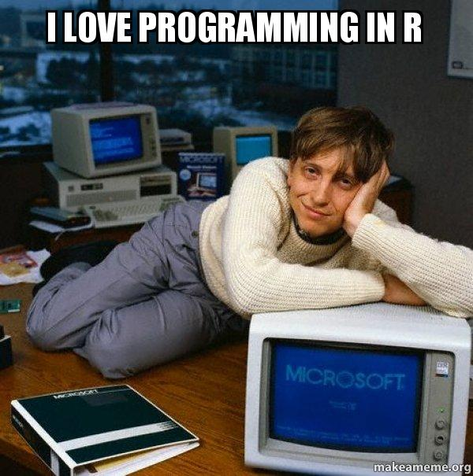

layout: true

```{r setup, include = FALSE}
source("../xaringan_r_setup.R")
xaringanExtra::use_xaringan_extra(c("tile_view", "clipboard"))
xaringanExtra::use_extra_styles(
  hover_code_line = TRUE,         #<<
  mute_unhighlighted_code = FALSE  #<<
)
```

<div class="my-footer">
  <div style="float: left;"><span>`r gsub("<br />", ", ", gsub("<br /><br />|<a.+$", "", metadata$author))`</span></div>
  <div style="float: right;"><span>`r metadata$location`, `r metadata$date`</span></div>
  <div style="text-align: center;"><span>`r gsub(".+<br />", " ", metadata$subtitle)`</span></div>
</div>


```{css, echo = FALSE}
.tinyish .remark-code { /*Change made here*/
  font-size: 70% !important;
}

.tinyisher .remark-code { /*Change made here*/
  font-size: 50% !important;
}
```

---

## Content of this programming session 
.pull-left[
**What you will learn**
- How to work with different data types
- How to write simple functions
- How to write simple loops
- Combine functions and loops
]

.pull-right[
**What you won't learn**
- Full-blown programming introduction
- Lengthy comparison to other languages
- Exhausting review of data types, methods, and classes
- Debugging
]

---

## What is programming?
So, the all-knowing Wikipedia says programming involves:
- analysis
- generating algorithms
- profiling the accuracy and resource consumption of algorithms
- implementation of algorithms in a chosen programming language

`r emo::ji("index_pointing_up")`: 
- **What is your experience with programming?**
- **Are there any specific problems/issues that you solved?**

.footnote[https://en.wikipedia.org/wiki/Computer_programming]

---
class: middle

```{r echo = FALSE, out.width = "60%"}

```

.footnote[https://makeameme.org/meme/i-love-programming]

---

## `R` is/as a programming language
Initially, `R` was created for statistical analysis in 1992. It reaches back to the language `S` from 1976. Here are the caveats we usually find when people talk about `R` as a programming language:
- `R` package designers are no computer scientists
  - They are statisticians, often working on cutting-edge stuff
- However, because of that `R` is known as not being as efficient as other languages
  - I recommend: judge by yourself, often this is a prejudice
  - It also depends on the **programming**

Generally, many ways to interact with the language are similar to using mathematical notation. Please don't get scared by that, yet this is why we deal with vectors, matrices, and so forth. So be prepared.

---

## It boils down to...
.pull-left[
**How your data are stored (data types)**
- 'Numbers' (Integers & Doubles)
- Character Strings
- Logical
- Factors
- ...
- There's more, e.g., expressions, but let's leave it at that
]

.pull-right[
**Where your data are stored (data formats)**
- Vectors
- Matrices
- Arrays
- Data frames / Tibbles
- Lists
]

Admittedly, data types and data formats are not an exciting topic. They seem to be a necessary inconvenience rather than something you want to talk about during the Summer School rooftop party (hopefully) next year. But maybe you want to think about them as containers comprising the intriguing information you aim to analyze. Everybody likes snacks, but nobody is too fond of the Tupperware container for the (vegetarian) gummi bears, right?

.footnote[https://www.stat.berkeley.edu/~nolan/stat133/Fall05/lectures/DataTypes4.pdf]

---

## Numeric data
.small[
*Integers* are values without a decimal value. To be explicit in `R` in using them, you have to place an `L` behind the actual value, just like that:

```{r}
1L
```

By contrast, *doubles* are values with a decimal value.

```{r}
1.1
```

We can check data types by using the `typeof()` function.

```{r}
typeof(1L)
typeof(1.1)
```
]

---

## Character strings
At first glance, a *character* is a letter somewhere between a-z. *String* in this context might mean that we have a series of characters. However, numbers and other symbols can be part of a *character string*, which can then be, e.g., part of a text. In `R`, character strings are wrapped in quotation marks.

```{r}
"Hi. I am a character string, the 1st of its kind!"
```

So character strings are meaningless, which means that there are no values associated with their content unless we change that, e.g., with factors.

---

## Factors
If you're a *Stata* (or *SPSS*) user, you may already be quite familiar with factors. Factors are data types that assume that their values are not continuous, e.g., as in ordinal or nominal data. They are useful when inserted into regression models, as we will see later in this course.

```{r}
factor(1.1)
factor("Hi. I am a character string, the 1st of its kind!")
```

Factors take numeric data or character strings as input as they simply convert them into so-called levels. This concept may be a little bit abstract for the time being. It's just essential to have heard about them before you learn more about them in the data wrangling session.

---

## Logical values
Logical values are basically either `TRUE` or `FALSE` values. These values are produced by making logical requests on your data.

```{r}
2 > 1
2 < 1
```

I'd say that logical values are at the heart of creating loops. For this purpose, we need way more logical operators to request `TRUE` or `FALSE` values.

---

## Logical operators
Here are all (?) logical operators in `R`:
- `<` 	less than
- `<=` 	less than or equal to
- `>` 	greater than
- `>=` 	greater than or equal to
- `== `	exactly equal to
- `!=` 	not equal to
- `!x` 	Not x
- `x | y` 	x OR y
- `x & y `	x AND y
- `isTRUE(x)` 	test if X is TRUE 
- `isFALSE(x)` 	test if X is FALSE 

.footnote[https://www.statmethods.net/management/operators.html]

Moreover, there are some more `is.PROPERTY_ASKED_FOR()` functions, such as `is.numeric()`, which also return `TRUE` or `FALSE` values.

---

## `R`'s data formats
So now, here are the Tupperware containers:

```{r echo = FALSE, out.width = "75%"}
knitr::include_graphics("./pics/9213.1526125966.png")
```

.footnote[https://devopedia.org/r-data-structures]

Like the Tupperware you can put in your microwave, R data formats can also get quite complicated.

---

## Vectors
Vectors are built by enclosing your content with `c()` ("c" for "concatenate")

```{r}
numeric_vector   <- c(1, 2, 3, 4)
character_vector <- c("a", "b", "c", "d")

numeric_vector
character_vector
```

Vectors are really like vectors in mathematics. Initially, it doesn't matter if you look at them as column or row vectors.

---

## ...but it matters when you combine vectors
Using the function `cbind()` or `rbind()` you can either combine vectors column-wise or row-wise, respectively.

```{r}
cbind(numeric_vector, character_vector)
rbind(numeric_vector, character_vector)
```

They are now matrices (also numeric values are coerced into strings).

---

## Matrices
Matrices are the basic rectangular data format in R.

```{r}
fancy_matrix <- matrix(1:16, nrow = 4)

fancy_matrix
```

You cannot store multiple data types, such as strings and numeric values in the same matrix.  Otherwise, your data will get coerced to a common type, as seen in the previous slide.
- In fact, this is something that happens already within vectors.

```{r}
c(1, 2, "evil string")
```

---

## Arrays
Arrays are stacked vectors, as shown in the figure. I haven't seen too many applications with them in `R`, to be honest. But there's definitely a use, probably when implementing estimation methods.

.pull-left[
```{r arrays, eval = FALSE}
vector_1 <- c(1, 2, 3)
vector_2 <- 5:11

array(
  c(vector_1, vector_2), 
  dim = c(2, 3, 2)
)
```
]

.pull-right[
```{r ref.label = "arrays", echo = FALSE}
```

It repeatedly goes over the input vectors.
]


---

## Data frames
While matrices are used, e.g.,--\*drumroll\*-- for matrix operations, data frames resemble more the data formats most of you are probably already familiar with. We can build data frames by hand as here:

.tinyish[
```{r data_frames, eval = FALSE}
library(randomNames) # a name generator package

fancy_data <-
  data.frame(
    who = 
      randomNames(n = 10, which.names = "first"),
    age = 
      sample(14:49, 10, replace = TRUE), # you see what we are doing here?   
    salary_2018 = 
      sample(15:100, 10, replace = TRUE),  
    salary_2019 = 
      sample(15:100, 10, replace = TRUE),
    eggs_available = 
      sample(c(TRUE, FALSE), 10, replace = TRUE)
  )

fancy_data
```
]

.right[`r emo::ji("left_arrow_curving_right")`]

---
class: middle
```{r ref.label = "data_frames", echo = FALSE}
```

---

## tibbles
`data.frames` tend to be pretty large, and printing them on your screen can get difficult. As part of the `tidyverse` (we will talk about what this is in the session on *Data Wrangling*), tibbles facilitate printing (and adding more metadata to the columns of a `data.frame`). Instead of using `data.frame()` for our data creation we could have been using `tibble()`. Or we convert an existing `data.frame`, which looks like that:

```{r as_tibbles, eval = FALSE}
library(tibble)
as_tibble(fancy_data)
```

.right[`r emo::ji("left_arrow_curving_right")`]

---
class: middle
```{r ref.label = "as_tibbles", echo = FALSE}
```

---

## One last type you should know: lists
Lists are perfect for storing numerous and potentially diverse information in one place.

```{r fancy_list, eval = FALSE}
fancy_list <- 
  list(
    numeric_vector,
    character_vector,
    fancy_matrix,
    fancy_data
  )

fancy_list
```

.right[`r emo::ji("left_arrow_curving_right")`]

---
class: middle
.tinyish[
```{r ref.label = "fancy_list", echo = FALSE}
```
]

---

## Nested lists
```{r fancy_nested_list, eval = FALSE}
fancy_nested_list <-
  list(
    fancy_vectors = list(numeric_vector, character_vector),
    data_stuff = list(fancy_matrix, fancy_data)
  )

fancy_nested_list
```

.right[`r emo::ji("left_arrow_curving_right")`]

---
class: middle
.tinyish[
```{r ref.label = "fancy_nested_list", echo = FALSE}
```
]

---

## Accessing elements by index
Generally, there is this use of `[index_number]`-logic in `R` to access only a subset of information in data, no matter if we have vectors or data frames.

Say, we want to extract the second element of our `character_vector` object, we could do that like this:

```{r}
character_vector[2]
```

---

# More complicated cases: matrices
Matrices can have more dimensions, often you want information from a specific row and column.

```{r eval = FALSE}
a_wonderful_matrix[number_of_row, number_of_column]
```

*Note*: You can do the same indexing with `data.frame`s

---

## Matrices and subscripts (as in mathematical notation)
Identify rows, columns, or elements using subscripts is similar to matrix  notation:

```{r eval = FALSE}
fancy_matrix[, 4] # 4th column of matrix
fancy_matrix[3,] # 3rd row of matrix
fancy_matrix[2:4, 1:3] # rows 2,3,4 of columns 1,2,3 
```

It's really like in math, and you can perform standard mathematical operations, such as matrix multiplications.

```{r}
fancy_matrix[2:4, 1:3] %*% fancy_matrix[1:3, 2:4]
```

---

## The case of data frames
A nice feature of `data.frames` or `tibbles` is that their columns are names, just as variable names in ordinary data. It would be cumbersome do use index numbers to extract a specific column/variable, right? Do not fear:

```{r}
fancy_data$who
```

Just place a `$`-sign between the data object and the variable name.

---

## `[]` in data frames
In programming, as you will learn, we often have to rely on character strings as input information, e.g., for iterating over data. We can use also `[]` to access variables by name. 

.pull-left[ 
Not only this way:

```{r}
fancy_data[1]
```
]

.pull-right[
But also this way:

```{r}
fancy_data["who"]
```
]

---

## Difference between `[]` and `[[]]` 

```{r echo = FALSE}
knitr::include_graphics("./pics/indexing_lists.png")
```

.footnote[https://twitter.com/hadleywickham/status/643381054758363136/photo/1]

---

## Object orientation in `R`
`R` is an object-orientated language
- That's more than just assigning, e.g., a number to an object and working on it like: 

```{r}
object <- 2
object + 3
```

---

## Objects have attributes
Object orientation also includes, e.g., emphasis on attributes of data. They have a structure and belong to a class:

```{r}
str(character_vector)
class(character_vector)
```
  
But we'll leave it at that now, so don't worry too much about this topic.

---

## Functional Programming: In `R`, everything's a function (more or less)
So you might already be familiar with using functions in `R` (at least we have used them heavily on the previous slides). Functions are applied as shown here:

```{r eval = FALSE}
fancy_function(data)
```

They can be nested, for example:

```{r}
log(sum(c(1, 2, 3)))
```

Later on, we will learn about pipes `%>%` which help navigate some issues with too many nesting levels.

---

## Defining your own function is straightforward
First, let's create a simple function that is pasting together some strings and numbers.

```{r}
milk_bought <- function (n_bottles) {
  
  # define our string
  our_string <- 
    paste0("I have bought ", n_bottles, " bottles of milk")
  
  our_string
}
```

Now, we can simply apply it to some data as in any other `R` function.

```{r}
milk_bought(n_bottles = 20)
```

---

## Loops
.pull-left[
We can use loops to iterate through data, applying a function. The loop types we'll use here are:
- if-else statements/requests
- iteration with
  - `for()` 
  - `while()`
  - and the `apply` family
]

.pull-right[
```{r echo = FALSE}
knitr::include_graphics("./pics/forloops.png")
```
]

---

class: middle

There's this silly programmer joke:

.large[
> A room mate asked his friend who is a programmer to go shopping: "hey, can you buy a bottle of milk? Oh and if they have eggs, buy 12". So the programmer went shopping. When he got back, he bought 12 bottles of milk and his room mate asked "why the heck did you bought 12 bottle of milk?!" The programmer responded: "they have eggs" (formatting done by me)
]

.footnote[https://www.reddit.com/r/Jokes/comments/5qyxar/a_programmer_goes_shopping/]

---

## Architecture of the joke

```{r echo = FALSE}
DiagrammeR::grViz("digraph flowchart {
      # node definitions with substituted label text
      node [fontname = Helvetica, shape = rectangle]        
      tab1 [label = '@@1']
      tab2 [label = '@@2']
      tab3 [label = '@@3', shape = diamond]
      tab4 [label = '@@4', shape = diamond]
      tab5 [label = '@@5']
      tab6 [label = '@@6']

      # edge definitions with the node IDs
      tab1 -> tab2;
      tab2 -> tab3;
      tab2 -> tab4;
      tab3 -> tab5;
      tab4 -> tab6;
      }

      [1]: 'Room mate is asked to buy a bottle of milk'
      [2]: 'Do they have eggs?'
      [3]: 'Yes'
      [4]: 'No'
      [5]: 'Room mate buys 12 bottles of milk'
      [6]: 'Room mate buys 1 bottle of milk'
      ",
      height = 400)
```

---

## if else architecture in `R`
Using if-else statements in `R` requires at least 3 steps:
1. Starting the loop with `if()`
2. Add the condition to be tested in the parentheses of the `if(condition)`
3. Write a function or procedure on data in the curly brackets of the `if(condition){ ... }`

For example:

```{r}
if (1 < 2) {
  1 + 2
}
```

---

## Adding else statements
In a fourth step, we can add an `else { ... }`

```{r}
if (1 > 2) {
  1 + 2
} else {
  2 + 5
}
```

So, the general architecture is like this:
```{r eval = FALSE}
if (condition) {
  function_to_apply(data)
} else {
  other_function_to_apply(data)
}
```

(We could also test for another condition in the else statements with `else if()`)

---

## Translation of our fabulous joke into `R`
We create a vector for our two scenarios (eggs available or not).

```{r}
eggs_available <- c(TRUE, FALSE)
```

```{r}
if (eggs_available[1]) {
  milk_bought(n_bottles = 12)
} else {
  milk_bought(n_bottles = 1)
}
```

```{r}
if (eggs_available[2]) {
  milk_bought(n_bottles = 12)
} else {
  milk_bought(n_bottles = 1)
}
```

---

## Extending our function to be able to speak proper english

```{r}
milk_bought_2 <- function (n_bottles) {
  if (n_bottles < 2) {
    our_string <-
      paste0(
        "I have bought ", 
        n_bottles, 
        " bottle of milk"
      )
  } else {
    our_string <-
      paste0(
        "I have bought ",
        n_bottles, 
        " bottles of milk"
      )
  }
  
  our_string
}
```

---

## Now, that's better, right?
```{r}
if (eggs_available[2]) {
  milk_bought_2(n_bottles = 12)
} else {
  milk_bought_2(n_bottles = 1)
}
```

---

## ifelse() shortcut
There's  a shortcut using the function `ifelse()` when the operations applied to the data are not too complicated (or at least embedded in another function as in our case):

```{r}
ifelse(
  eggs_available[2],              # condition
  milk_bought_2(n_bottles = 12),  # if condition is true
  milk_bought_2(n_bottles = 1)    # else if condition is false
)
```

But be aware that `if()` and `ifelse()` [were designed for different purposes](https://stackoverflow.com/a/22433767), and the latter is not always a shortcut rather than data type-specific. It is handy when you aim to assign the result, e.g., to an object or a variable in a data frame. Ordinary if-else statements are more general and should always be your choice when you are not sure.

---

## And now put it all together: function in a function
.tinyisher[
```{r}
milk_bought <- function (who, n_bottles, eggs_available) {
  
  # get the right grammar for the right person
  buyer <-
    ifelse(
      who == "I",
      "I have ",
      paste0(who, " has ")
    )
  
  # basic milk buying function
  buy_milk <- function (n_bottles) {
      ifelse(
        n_bottles < 2,
        paste0(buyer, "bought ", n_bottles, " bottle of milk"),
        paste0(buyer, "bought ", n_bottles, " bottles of milk")
      )
  }
  
  # apply the basic milk buying function
  our_string <-
    ifelse(
      eggs_available,
      buy_milk(n_bottles = 12),
      buy_milk(n_bottles = 1)
    )
  
  # get the results
  our_string
}
```
]

---

## The result

```{r}
milk_bought(who = "I", n_bottles = 12, eggs_available = TRUE)
milk_bought(who = "Johannes", n_bottles = 12, eggs_available = FALSE)
```

---

class: center, middle

# [Exercise](https://jobreu.github.io/r-intro-gesis-2020/exercises/Day1_2_Programming_Exercise_1_question.html) time `r ji("weight_lifting_woman")``r ji("muscle")``r ji("running_man")``r ji("biking_man")`

## [Solutions](https://jobreu.github.io/r-intro-gesis-2020/solutions/Day1_2_Programming_Exercise_1_solution.html)

---

## `for()` loops
In my opinion, loops using the `for()` function are some of the most useful tools in functional programming.

They, e.g., enable iterating through input data and applying functions to each element of the data
- it depends on the specific purpose what defines this element
  - the elements can be rows, columns, list elements, etc.
  
- hence, it is crucial to think about the iterator of the specific call

---

## Architecture of for loops

```{r eval = FALSE}
for (iterator_name in data) {
  function_to_apply(iterator_name)
}
```

If we had data about a whole gang of programmers buying milk experiencing varying availability of eggs, we could apply our function to each of them. Let's try that out!

---

```{r}
for (row_number in 1:nrow(fancy_data)) {
  for_output <- 
    milk_bought(
      who = fancy_data$who[row_number], 
      n_bottles = 12, 
      eggs_available = fancy_data$eggs_available[row_number]
    )
  
  print(for_output) # output must be printed
}
```

---

## `while()` loops

> The next day, the same programmer's roommate calls him to ask where he is. "I'm back at the grocery," says the programmer. "While you're there, pick up some bread. Thanks!" says the roommate. The programmer never comes home.

.footnote[https://www.reddit.com/r/Jokes/comments/5qyxar/a_programmer_goes_shopping/]

---

## Don't try this at home

```{r eval = FALSE}
still_there <- TRUE
while (still_there) {
  print("Yeah, there's some bread to pick up right here in the grocery store")
}
```

This runs into an infinite loop, which is what the joke is all about. 

---

## Better try this one
Yet, this infinite loop would also require that bread is infinitive.
- This is unrealistic.
- We may want to add a bread counter that can reach a minimum.

```{r}
still_there <- TRUE
bread_counter <- 10
```

---

## Voilà
.tinyish[
```{r}
while (still_there) {
  message("Yeah, there's some bread to pick up right here in the grocery store.")

  bread_counter <- bread_counter - 1

  if (bread_counter < 1) {
    return(message("Bread is empty, going home."))
  }
}
```
]

---

## Ok, let's take a breath for a while

**First of all: We're not finished yet (sorry!), but are there any intermediate questions?**

--

What have we learned so far?
- `R` a is a proper programming language that supports a lot of data types and a multitude of functions
- You can build your own functions and even nest them
- If-else-statements enable creating algorithms
- for-loops can be used to iterate through data
- while-loops are also useful for algorithms that should stop after a certain point is reached

What's left?
- Some vectorization that makes life easier: the apply family
- Using the pipe operator `%>%`
- Some notes on style

---

## The apply family
The apply family is aimed to make your life easier, saves you a lot of typing time and prevents you from writing explicit loops.
- provides a friendly interface to enter your data
- data come out in a standard format
- it may be faster than, e.g., writing a `for()` loop

However, we won't cover all functions of this precious family
- **`apply()`**
- **`lapply()`**
- **`sapply()`**
- **`tapply()`**
- `mapply()`, `rapply()`, & `vapply()` are left out

---

## apply()
The `apply()` function is useful when you want to fire up a short command across either all columns (option `MARGIN = 2`) _or_ rows (option `MARGIN = 1`).

```{r}
# means across columns/variables
apply(fancy_data[,3:4], 2, mean)

# means across rows/observations
apply(fancy_data[,3:4], 1, mean)
```

While there are plenty of functions for building descriptive tables already out there (e.g., `psych::describe` ), this becomes handy when you want to create them yourself.

---

## lapply()
`lapply()` is for more elaborated operations. However, there are no `MARGIN`  options, so let's see what happens when we use similar to what we did before:

```{r lapply_error, eval = FALSE}
lapply(fancy_data, mean)
```

.right[`r emo::ji("left_arrow_curving_right")`]

---
class: middle
.tinyish[
```{r ref.label = "lapply_error", echo = FALSE}
```
]

---

## lapply() returns lists
It might be a little bit uncomfortable, but `lapply()` returns each result of an iterated operation as a list element. Thus, the output of applying the function is a list. 

Some people don't like lists as they separate information from each other.

I like lists.

---

## The real merit lies in the iterators

.tinyish[
.pull-left[
```{r merit, eval = FALSE}
lapply(1:nrow(fancy_data), function (i) {
  ifelse(
    fancy_data$salary_2019[i] > mean(fancy_data$salary_2019), 
    1, 
    0
  )
})
```
]
]

.tinyisher[
.pull-right[
```{r ref.label = "merit", echo = FALSE}
```
]
]

---
## sapply()
`sapply()` is similar to `lapply()`. The minor but significant difference is that it returns vectors instead of lists. When you want to add the results of this function as a new column to your existing data, this comes in handy.

```{r sapply, eval = FALSE}
fancy_data$poverty_indicator <- 
  sapply(1:nrow(fancy_data), function (i) {
    ifelse(
      fancy_data$salary_2019[i] > mean(fancy_data$salary_2019), 
      1, 
      0
    )
  })

fancy_data
```

.right[`r emo::ji("left_arrow_curving_right")`]

---
class: middle
.tinyish[
```{r ref.label = "sapply", echo = FALSE}
```
]

---

## tapply()
Finally, `tapply()` is useful when you want to perform an action across different groups in your data.

```{r}
tapply(fancy_data$salary_2019, fancy_data$eggs_available, mean)
```


---

## Let's end this loop
At this point, we stop adding more looping functions to our inventory. In `R`, there are definitely more functions that at least implicitly use loops and apply-like functions (for a nice overview, you can, e.g., have a look at http://uc-r.github.io/apply_family). 

We have left out some newer `tidyverse` functions, e.g., from the [`purrr`](https://purrr.tidyverse.org/) package. If you have any more questions about that, please let us know. But for now, we will turn to another feature of modern programming in `R`. It will be way more supportive for your daily actions after you have converted to a full-time `R`-user after this course:

.center[**pipes**]

---

## What is a pipe?
```{r pipe_johannes, out.width = "40%", echo = FALSE}
knitr::include_graphics("./pics/pipe_office_decoration.jpg")
```
.center[<small><small>Source: Johannes' office </small></small>]

You might know them from other scripting utilities 
- e.g., `bash` where a `|` operator is used

---

## Nested functions in base `R`
First, let's load some data (we will learn more about that tomorrow):

```{r read_mtcars, echo = TRUE, message = FALSE}
library(readr)
mtcars <- read_csv(readr_example("mtcars.csv"))
```

Say, if we wanted to calculate the mean value of the variable `mpg`, we could use this command:

```{r read_mtcars_mpg, echo = TRUE, message = FALSE}
mean(read_csv(readr_example("mtcars.csv"))$mpg)
```

Pretty, isn't it? Well...

---

## Make it prettier with base `R`
We can use indentation to alleviate issues with readability:

```{r read_mtcars_mpg_intend, echo = TRUE, message = FALSE}
mean(
  read_csv(
    readr_example("mtcars.csv")
    )$mpg
  )
```

This works. But it also has some flaws:
- Don't you dare to forget closing a bracket
- It's not easy to grasp which operation is the most important one
  - Is it loading the data?
  - Is it choosing the proper variable?
  - Or the calculation of the mean value?

---

## Disentangling commands
An easy way would be:

```{r read_mtcars_mpg_disentangled_1, echo = TRUE, message = FALSE}

file_string         <- "mtcars.csv"
example_file        <- readr_example(file_string)
example_file_loaded <- read_csv(example_file)
mean(example_file_loaded$mpg)
```

Or, to prevent the creation of too many separate objects:

```{r read_mtcars_mpg_disentangled_2, echo = TRUE, message = FALSE}

tmp_object          <- "mtcars.csv"
tmp_object          <- readr_example(tmp_object)
example_file_loaded <- read_csv(tmp_object)
mean(example_file_loaded$mpg)
```

Of course, you can mix these approaches to your liking...

---

## Pipes as a solution?
Pipes disentangle the whole process with an alternative approach by applying any involved function step by step:

```{r read_mtcars_mpg_pipe, echo = TRUE, message = FALSE}
"mtcars.csv" %>% 
  readr_example() %>% 
  read_csv() %>% 
  .$mpg %>% 
  mean()
```

Most importantly, the central dataset is now on top and the starting point of everything.

---

## Formal definition of pipes: basic logic
Usually, in `R` we apply functions as follows:

```{r function_r, echo = TRUE, eval = FALSE}
f(x)
```

In the logic of pipes this function is written as:

```{r function_pipe, echo = TRUE, eval = FALSE}
x %>% f()
```

Thus, the inner argument/object is placed before the actual function call.

---

## Formal definition of pipes: first argument
In cases of multiple arguments, `x` is always the first argument of the function.

Base R:

```{r function_r_arguments, echo = TRUE, eval = FALSE}
f(x, y)
```

.center[vs.]

Piping:

```{r function_pipe_arguments, echo = TRUE, eval = FALSE}
x %>% f(y)
```

---

## Formal definition of pipes: `.` as placeholder
Previously, we have learned that `x` always refers to the first argument. We can also make this explicit:

```{r formal_pipe, echo = TRUE, eval = FALSE}
x %>% f(., y)
```

This is useful in cases in which `x` does not refer to the first argument:

```{r formal_pipe_argument, echo = TRUE, eval = FALSE}
x %>% f(y, z = .)
```

---

## Notes on the styling of pipes: indentation
We can write pipes in one line:

```{r pipe_row, echo = TRUE, eval = FALSE}
u %>% v %>% w %>% x %>% y %>% z
```

Yet, this destroys the readability. At least for pipes with more than one `%>%` using multiple lines is easier to read:

```{r pipe_line, echo = TRUE, eval = FALSE}
u %>% 
  v %>% 
  w %>% 
  x %>% 
  y %>% 
  z
```

---

## Notes on the styling of pipes: nesting
As pipes are so convenient you may be tempted to nest operations within pipes and to merge separate processes. For example:

```{r pipe_nested, echo = TRUE, eval = FALSE}
obj_1 <- 
  u %>% 
  v %>% 
  w

z %>% 
  f(obj1, x) %>% 
  y
```

---

# Notes on the styling of pipes: nesting
To:

```{r pipe_nested_2, echo = TRUE, eval = FALSE}
z %>% 
  f(
    u %>% 
      v %>% 
      w, 
    x
  ) %>% 
  y
```

While this is cool, it can get cumbersome to read.
- It may be better to keep the processes split up in pipes with more than one `%>%` operator 
- Hadley Wickham recommends to never use more than ten `%>%` anyway: https://r4ds.had.co.nz/pipes.html#when-not-to-use-the-pipe

---

# Don't overthink pipes
.column-left-half[
Pipes are so nice, you may be tempted to use them all the time. Some of you may even spend hours to create one single data preparation workflow in one single pipe. This is awesome. However, it's not very efficient and also misses the main purposes of applying pipes which are:
- readability
- reproducibility
]

.column-right-half[
```{r crazy_pipes, out.width = "100%", echo = FALSE}
include_graphics("./pics/crazy_pipes.png")
```
]

---

## Alternative pipe operators from `magrittr` and others

- `%<>%` assignment pipe to update a value or data frame (instead of using `<-`)
- `%$%`  'exploding' pipe when passing an individual vector
- `%T>%` Tee pipe for intermediate returning of results within a pipe workflow (e.g., a plot)

There are also other general pipe implementations, e.g., the pipe operator `%>>%` from the [`pipeR` package](https://renkun-ken.github.io/pipeR-tutorial/index.html) or `%.>%` from the [`wrapr` package](https://github.com/WinVector/wrapr). Our used `%>%` is just the most popular one. Discussions about differences may lead to rather academic disputes, as you can see in this [older](https://www.r-bloggers.com/difference-between-magrittr-and-piper/) and this [newer](https://win-vector.com/2018/04/06/magrittr-and-wrapr-pipes-in-r-an-examination/) post.

---

## Some precocious notes on style
.column-left-half[
In some ways, writing code is similar to writing a novel; it's a craft where you set the tone of how you want to be perceived from your future-you and others.
  
What helps to be understood is the styling of your code.
]

.column-right-half[
```{r out.width = "70%", echo = FALSE}

```
https://images-na.ssl-images-amazon.com/images/I/71z4varBITL.jpg
]

---

## General elements of style
These are only some of the topics you will face when researching for styling your code.
- line length (see the ["sacred 80 column rule"]( https://www.emacswiki.org/emacs/EightyColumnRule))
- indentions
- variable/object naming
- comments
- assignment rules

`R` is pretty flexible in styling which is why it is necessary to think about these topics
- compare that to `Python` which has strict indention rules

---

## Style guides out there
It's really not uncommon to follow a specific style guide that already exists.

Many institutions define styles for several different programming languages, such as [Google's style guide for `R`](https://google.github.io/styleguide/Rguide.html)

It really doesn't matter what style you use as long as you are consistent (at least in one single `R`-file, right?).

---

## Coding in style `r ji("sunglasses")`

[The `tidyverse` style guide](https://style.tidyverse.org/) by Hadley Wickham  
  
[`styler`](http://styler.r-lib.org/) package (incl. RStudio add-in)

```{r install & load styler, eval = F, echo = T}
install.packages("styler")
library(styler)

```

From the package documentation:
- `style_file()` styles .R and/or .Rmd files.
- `style_dir()` styles all .R and/or .Rmd files in a directory.

```{r, out.width = "50%", echo = FALSE}
include_graphics("./pics/styler_addin.png")
```

---

class: center, middle

# [Exercise](https://jobreu.github.io/r-intro-gesis-2020/exercises/Day1_2_Programming_Exercise_2_question.html) time `r ji("weight_lifting_woman")``r ji("muscle")``r ji("running_man")``r ji("biking_man")`

## [Solutions](https://jobreu.github.io/r-intro-gesis-2020/solutions/Day1_2_Programming_Exercise_2_solution.html)

---

# Extracurricular activities
`R` can also be used for creating text-based adventure games. Play the fun short text adventure ["Castle of R"](https://github.com/gsimchoni/CastleOfR) which was designed to test your programming skills using `base R`.

Also check out the [background](http://giorasimchoni.com/2017/09/10/2017-09-10-you-re-in-a-room-the-castleofr-package/) of the programming of the game/package.