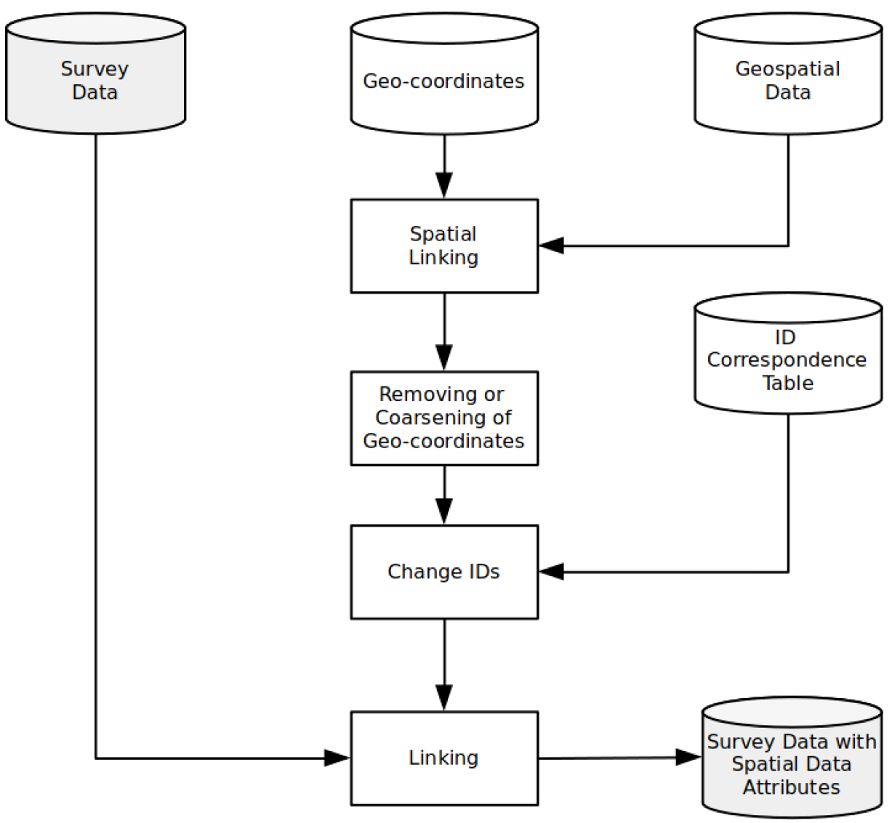

layout: true

```{r setup, include = FALSE}
source("../xaringan_r_setup.R") 
options(warn=-1)
xaringanExtra::use_xaringan_extra(c("tile_view", "clipboard"))
xaringanExtra::use_extra_styles(
  hover_code_line = TRUE,         #<<
  mute_unhighlighted_code = TRUE  #<<
)
```

<div class="my-footer">
<div style="float: left;"><span>`r gsub("<br />", ", ", gsub("<br /><br />|<a.+$", "", metadata$author))`</span></div>
<div style="float: right;"><span>`r metadata$location`, `r metadata$date`</span></div>
<div style="text-align: center;"><span>`r gsub(".+<br />", " ", metadata$subtitle)`</span></div>
</div>
  
```{css, echo = FALSE}
.tinyish .remark-code { /*Change made here*/
    font-size: 70% !important;
}

.tinyisher .remark-code { /*Change made here*/
  font-size: 50% !important;
}
```

---

## What are geospatial data?
.pull-left[
Geospatial data are nothing totally crazy as they are data like any other data. The sole difference to other data is that observations depict geometries. These can be:
- Points
- Lines
- Polygons
- Grids
]

.pull-right[
```{r echo = FALSE}
knitr::include_graphics("./pics/geometries.png")
```
]

---

## Geospatial data formats
We usually differentiate between vector and raster data formats. Vector data provide accuracy to the point when you pick one point, say randomly on a map. Usually, points, lines, and polygons are represented in vector data format. Raster data are basically a table where one general set of metadata defines the extent and resolution of raster cells. Grids are usually defined as raster data, although you could also convert them to the vector format.

---

## Geospatial data can be layered
```{r echo = FALSE, out.width = "70%"}
knitr::include_graphics("./pics/layers.png")
```

---

## Vector data in `R` 
.pull-left[
Traditionally, there has been the `sp` package to represent vector data in R. For example,
- `SpatialPointsDataFrames` for points
- `SpatialLinesDataFrames`for lines
- `SpatialPolygonDataFrames` for polygons

These object types are rather complex and not easy to work with. For some time now, and this is the cutting-edge development in spatial `R`, we can rely on one excellent `sf` package. It implements the [ISO 19125](https://www.iso.org/standard/40114.html) standard for geospatial data, called "simple features".
]

.pull-right[
```{r echo = FALSE}
knitr::include_graphics("./pics/sf.jpg")
```

<small><small>Illustration by [Allison Horst](https://github.com/allisonhorst/stats-illustrations) </small></small>
]

---

## Simple features in the `sf` package
Features are observations in data: 

> [A feature is thought of as a thing, or an object in the real world, such as a building or a tree](https://r-spatial.github.io/sf/articles/sf1.html)

We won't go into too much detail on all possible features or geometries that can be represented in the format of the simple features. What is important to know when working with such geospatial data, however, is that simple features in `R` are simple data frames with observations in the rows and variables in the columns. One of the main differences to a plain `data.frame` or `tibble` is that they comprise a `geometry` column and some additional metadata, such as the coordinate reference system.

---

## The importance of coordinate references systems (CRS)
Coordinate reference systems are the 'translation' of plenary points on earth to the 2D surface, which we know from maps. They can be more precise for specific areas, or more general and less precise for larger areas. If you mess them up, your data is messed up.

```{r echo = FALSE, out.width = "70%"}
knitr::include_graphics("./pics/crs.png")
```

---

## Essential background knowledge
To start with geospatial data, this is all you have to know. Probably because of *Google Maps* and similar services, we are so much used to looking at maps all day that dealing with geospatial data is no big deal anymore.

The world of geospatial data gets complicated, if we aim to do some really fancy stuff:
- geometric operations, e.g., cropping, cutting, or dissolving data

- spatial analysis as in spatial regression
  - have a look at the [`spdep`](https://cran.r-project.org/web/packages/spdep/index.html) package if you want to do that in `R`
  
---

## Make yourself at home
This session is about making yourself familiar with geospatial data. 

1. We will load two geospatial datasets, comprising different information, play with them, and create some maps.
  - [Muncipality boundaries data from the Federal Agency of Cartography and Geodesy (BKG)](https://gdz.bkg.bund.de/index.php/default/catalog/product/view/id/788/s/verwaltungsgebiete-1-250-000-ebenen-stand-01-01-vg250-ebenen-01-01/category/8/?___store=default)
  - [Land use data on soil sealing from the Monitor of Settlement and Open Space Development (IOER Monitor)](https://www.ioer-monitor.de/en/)
  
2. We will then simulate some coordinates for our *GESIS Panel* COVID-19 survey data. After that, we do some geospatial operations and add information from our geospatial data as additional attributes to the survey data.

That's a lot, so let's get started.

---

## First geospatial dataset: Municipality Boundaries of Germany
We don't have them stored in our folders. Let's download them first and unzip the folder and delete .zip file.

```{r eval = FALSE}
download.file(
  "https://daten.gdz.bkg.bund.de/produkte/vg/vg250_ebenen_0101/aktuell/vg250_01-01.tm32.shape.ebenen.zip",
  "./session_specific_data/vg250_01-01.tm32.shape.ebenen.zip"
)

unzip("vg250_01-01.tm32.shape.ebenen.zip")

unlink("vg250_01-01.tm32.shape.ebenen.zip")
```

Now we can load the file as a so-called shapefile with this command:

```{r}
municipalities <-
  sf::read_sf("./session_specific_data/vg250_01-01.tm32.shape.ebenen/vg250_ebenen_0101/VG250_GEM.shp") %>% 
  sf::st_transform(3035)
```

---

## It's a `tibble`

.tinyish[
```{r}
municipalities
```
]

---

## The `geometry` column

.tinyish[
```{r message = TRUE}
municipalities$geometry
```
]

---

## Want to have a first look? Let's plot the shape of Cologne

.tinyish[
.pull-left[
```{r cologne_plot, eval = FALSE}
municipalities %>% 
  dplyr::filter(GEN == "Köln") %>%
  ggplot() +
  geom_sf()
```
]
]

.pull-right[
```{r ref.label = "cologne_plot", echo = FALSE}
```
]

---

## Second geospatial dataset: Soil sealing
This is a raster dataset, things are a little bit different here. I have already prepared the data for importing, so it's a rather short command. 

```{r}
soil_sealing <- 
  raster::raster("./session_specific_data/S40RG_2015_100m.tif")
```

---

## The `raster` format

.tinyish[
```{r}
soil_sealing
```
]

---

## Let's plot it as well but only for Cologne

.tinyish[
.pull-left[
```{r sealing_plot, eval = FALSE}
soil_sealing %>% 
  raster::crop(
    ., 
    municipalities %>% 
      dplyr::filter(GEN == "Köln")
  ) %>% 
  raster::as.data.frame(xy = TRUE) %>% 
  ggplot() +
  geom_raster(aes(x, y, fill = S40RG_2015_100m))
```
]
]

.pull-right[
```{r ref.label = "sealing_plot", echo = FALSE}
```
]

---

## Mapping interactively
The `tmap` package is a great resource to create fast and good looking maps. You should definitely look at the [introductionary vignette](https://cran.r-project.org/web/packages/tmap/vignettes/tmap-getstarted.html) of the package. What's also great about the package is that you can use it to create excellent interactive maps using the [`leaflet` framework](https://leafletjs.com/).

```{r eval = FALSE}
library(tmap)

# set mode to "view" for interactive maps
tmap_mode("view")

# plot type of municipalities in NRW
municipalities %>% 
  dplyr::filter(SN_L == "05") %>% 
  tm_shape() +
  tm_polygons("BEZ")
```

---
class: middle

```{r echo = FALSE}
library(tmap)

# set mode to "view" for interactive maps
tmap_mode("view")

municipalities %>% 
  dplyr::filter(SN_L == "05") %>% 
  tm_shape() +
  tm_polygons("BEZ")
```


---

## Static mapping
We can plot the same map as a static map. This is helpful, if you, e.g., prepare a map for a journal publication or something similar. Under the hood, `tmap` creates a map with `ggplot2`, so that you can also use `ggplot2`-specific graphics manipulations.

```{r  eval = FALSE}
# set mode to "plot" for static maps
tmap_mode("plot")

municipalities %>% 
  dplyr::filter(SN_L == "05") %>% 
  tm_shape() +
  tm_polygons("BEZ")
```

---
class: middle

```{r echo = FALSE}
# set mode to "plot" for static maps
tmap_mode("plot")

municipalities %>% 
  dplyr::filter(SN_L == "05") %>% 
  tm_shape() +
  tm_polygons("BEZ")
```

---


## Workflow for spatial linking of survey data

.pull-left[
```{r echo = FALSE}

```
]

.pull-right[
Georeferenced survey data based on addresses are sensitive data. According to German data protection legislation, we are not allowed to store location information together with survey attributes.

But we are allowed to jointly store them with information extracted from geospatial data. Hence, we usually apply a workflow as shown on the left side.
]

---

## Load GESIS Panel Data
For our introduction of geospatial data, we again use the *GESIS Panel* COVID-19 survey dataset.

```{r load-gp-data, echo = FALSE}
gp_covid <-
  haven::read_sav(
    "../../data/ZA5667_v1-1-0.sav"
  ) %>% 
  sjlabelled::set_na(na = c(-1:-99, 97)) %>% 
  dplyr::mutate(
    likelihood_infection = hzcy001a,
    age_cat = as.factor(age_cat)
  ) %>% 
  sjlabelled::remove_all_labels()
```

```{r load-gp-data-display, eval = FALSE}
gp_covid <-
  haven::read_sav(
    "./data/ZA5667_v1-1-0.sav"
  ) %>% 
  sjlabelled::set_na(na = c(-1:-99, 97)) %>% 
  dplyr::mutate(
    likelihood_infection = hzcy001a,
    age_cat = as.factor(age_cat)
  ) %>% 
  sjlabelled::remove_all_labels()
```

---

## Sample points for *GESIS Panel* from municipalities

.tinyish[
.pull-left[
We are not allowed to work with 'real' geocoordinates from the *GESIS Panel*. Solution (for this demonstration): Make some up.
- sample 100 municipalities from the shapefile
- sample `nrow(gp_covid)` geocoordinates

```{r fake_addresses, eval = FALSE}
fake_gp_coordinates <-
  municipalities %>% 
  dplyr::sample_n(100) %>% 
  sf::st_sample(
    nrow(gp_covid)
    ) %>% 
  sf::st_as_sf()

ggplot() +
  geom_sf(data = fake_gp_coordinates)
```
]
]

.pull-right[
```{r ref.label = "fake_addresses", echo = FALSE}
```
]

---

## Spatial linking with municpalities
.pull-left[
At the heart of the spatial linking based on a 1:1 location is the function `sf::st_join()`. Similar to the relational data case, it searches for `links` between different datasets. The link here is provided by geolocations.

We remove the geocoordinates after the linking and use a column-bind to add the results to the survey data.
]

.pull-right[
.tiniysh[
```{r}
AGS <- 
  sf::st_join(
    fake_gp_coordinates,
    municipalities
  ) %>% 
  dplyr::select(AGS) %>% 
  sf::st_drop_geometry()

gp_covid_linked <-
  dplyr::bind_cols(
    gp_covid,
    AGS
  )
```
]
]

---

## Spatial linking with soil sealing

.pull-left[
```{r echo = FALSE}
knitr::include_graphics("./pics/buffers.png")
```
]

.pull-right[
For the linking of soil sealing, we use a fancier method to add this information to the *GESIS Panel* COVID-19 survey data: We draw circular buffers of 500 and 100 Meters around each geocoordinate. Subsequently, we extract the underlying mean values of soil sealing.
]

---

## Extracting the information

```{r eval = FALSE, echo = FALSE}
fake_gp_coordinates_500 <-
  fake_gp_coordinates %>% 
  sf::st_buffer(500)

fake_gp_coordinates_1000 <-
  fake_gp_coordinates %>% 
  sf::st_buffer(1000)


soil_sealing_500 <-
  raster::extract(
    soil_sealing,
    fake_gp_coordinates_500,
    fun = mean,
    na.rm = TRUE,
    df = TRUE
  ) %>% 
  .[,2]

soil_sealing_1000 <-
  raster::extract(
    soil_sealing,
    fake_gp_coordinates_1000,
    fun = mean,
    na.rm = TRUE,
    df = TRUE
  ) %>% 
  .[,2]

saveRDS(soil_sealing_500, "soil_sealing_500.rds")
saveRDS(soil_sealing_1000, "soil_sealing_1000.rds")
```

.pull-left[
We proceed as follows:
1. We calculate buffers of 500 and 1000 Meters using `sf::st_buffer()`
2. We then extract the information using using `raster::extract()`
]

.pull-right[
.tinyisher[
```{r eval = FALSE}
fake_gp_coordinates_500 <-
  fake_gp_coordinates %>% 
  sf::st_buffer(500)

fake_gp_coordinates_1000 <-
  fake_gp_coordinates %>% 
  sf::st_buffer(1000)


soil_sealing_500 <-
  raster::extract(
    soil_sealing,
    fake_gp_coordinates_500,
    fun = mean,
    na.rm = TRUE,
    df = TRUE
  ) %>% 
  .[,2]

soil_sealing_1000 <-
  raster::extract(
    soil_sealing,
    fake_gp_coordinates_1000,
    fun = mean,
    na.rm = TRUE,
    df = TRUE
  ) %>% 
  .[,2]
```
]
]


```{r echo = FALSE}
soil_sealing_500 <- readRDS("./session_specific_data/soil_sealing_500.rds")
soil_sealing_1000 <- readRDS("./session_specific_data/soil_sealing_1000.rds")
```

---

## Linking with fake geocoordinates
Our previous operations result in two vectors comprising the calculated values (no need to remove geocoordinates). Again, we simply add them with a column-bind to our data.

```{r}
gp_covid_linked <-
  dplyr::bind_cols(
    gp_covid_linked,
    soil_sealing_500 = soil_sealing_500,
    soil_sealing_1000 = soil_sealing_1000
  )
```

---

## What's next
The result of all this effort is a simple dataset like our ordinary survey data. It's the same dataset, just with some added variables. We now could think about research questions, involving individual attributes from the survey data and contextual attributes from the geospatial data. For example:

> Are older people less exposed to soil sealing since younger people live in denser areas?

---

## Running a cluster robust regression model
We can think of several statistical models to analyze such data. In survey data, it's always a good choice to use cluster-robust standard errors, and we now could apply them for our municipality data.

The [`estimatr` package](https://cran.r-project.org/web/packages/estimatr/index.html) provides regression models for clustered data. It lets you choose from a large variety of different standard error calculations. It also resembles the one from *Stata*. Let's try it out!

---

## Estimating the models

```{r}
library(estimatr)

lm_robust_500 <- 
  lm_robust(
    soil_sealing_500 ~ age_cat,
    data = gp_covid,
    cluster = gp_covid$AGS,
    se_type = "stata"
  )

lm_robust_1000 <- 
  lm_robust(
    soil_sealing_1000 ~ age_cat,
    data = gp_covid,
    cluster = gp_covid$AGS,
    se_type = "stata"
  )
```

---

## Output of the models
`estimatr` provides some nice output by default:

.tinyisher[
```{r echo = FALSE}
lm_robust_500
lm_robust_1000
```
]

---

## Comparison of the models with predictions

.tinyish[
.pull-left[
```{r predictions, eval = FALSE}
library(sjPlot)
library(patchwork)

plot_model(
  lm_robust_500, 
  type = "pred",
  term = "age_cat"
) /
  plot_model(
    lm_robust_1000, 
    type = "pred",
  term = "age_cat"
  )
```
]
]

.pull-right[
```{r ref.label = "predictions", echo = FALSE}
```
]

---

## Conclusion
`R` can function as a full-blown Geographic Information System (GIS). There is a lot more to do, especially on the side of geospatial data. We could model way more complex relationships between individual geocoordinates in space and their relation to other geospatial attributes, e.g., distance relations.

Also, the analyses shown on the previous slides are rather basic. In geospatial analysis, researchers are often interested in the geographic interdependence of their observations. Therefore, a spatial regression model may sometimes be a better choice.

*I hope you had a lovely first insight into what I am doing all day long with `R`.*

---

## Extracurricular activities

Instead of doing serious geospatial analyses, you can also use `R` to generate beautiful maps that you can print on your poster and decorate your office (or living room) with. This [tutorial](https://ggplot2tutor.com/streetmaps/streetmaps/) shows you how to such maps in a matter of minutes.    


