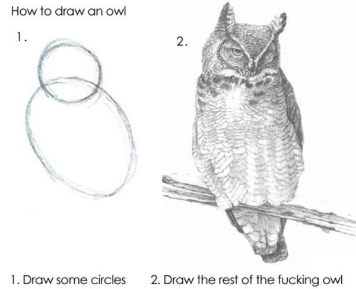
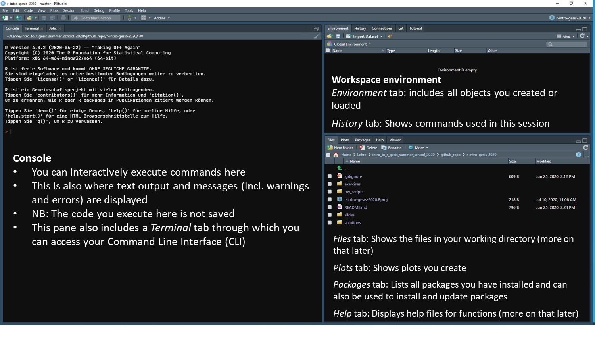
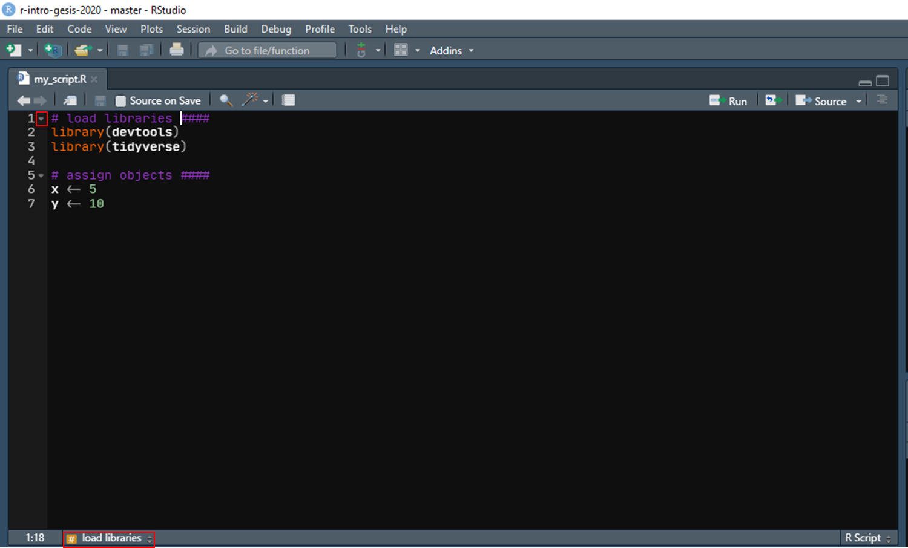
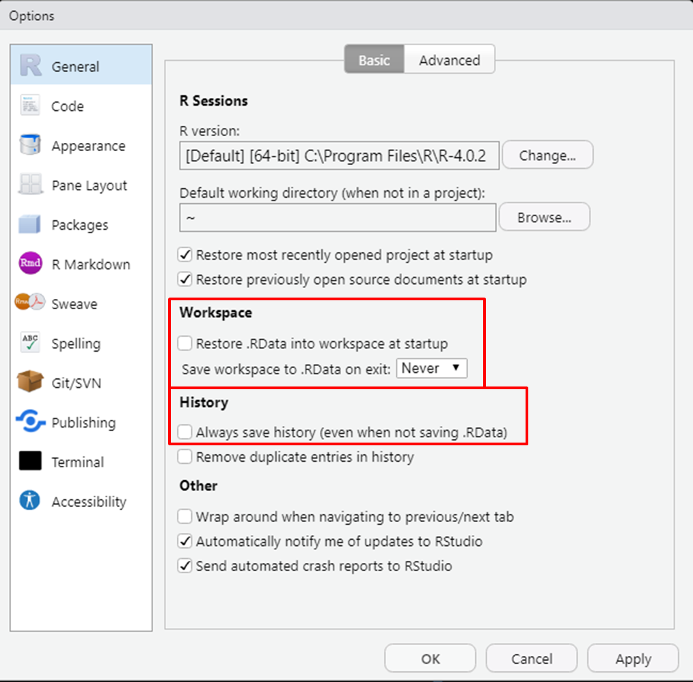
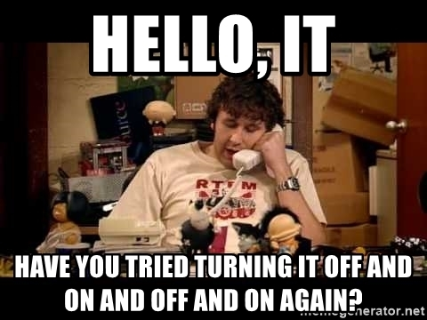

layout: true

```{r setup, include = F}
if (!require(easypackages)) install.packages("easypackages")
library(easypackages)

packages("rmarkdown", "knitr", "gadenbuie/xaringanExtra", "gadenbuie/tweetrmd", "huxtable", "hadley/emo", prompt = F)

options(htmltools.dir.version = FALSE)

opts_chunk$set(echo = FALSE, fig.align = "center")

xaringanExtra::use_xaringan_extra(c("tile_view", "clipboard"))
xaringanExtra::use_extra_styles(hover_code_line = TRUE,
                                mute_unhighlighted_code = FALSE)
```

<div class="my-footer">
  <div style="float: left;"><span>`r gsub("<br />", ", ", gsub("<br /><br />|<a.+$", "", metadata$author))`</span></div>
  <div style="float: right;"><span>`r metadata$location`, `r metadata$date`</span></div>
  <div style="text-align: center;"><span>`r gsub(".+<br />", " ", metadata$subtitle)`</span></div>
</div>

<style type="text/css">

pre {
  font-size: 10px
}
</style>

---

## About this course

In this course, we will provide an introduction to the basic concepts and functionalities of `R` and go through a prototypical data analysis workflow: import, wrangling, exploration, (basic) analysis, and reporting. 

By the end of this course you should...

- be comfortable with using *R* and *RStudio*
- be able to import, wrangle, and explore your data with *R*
- be able to conduct basic visualizations and analyses of your data with *R*

**Note**: This is not a statistics workshop. Our focus will be on learning how to use *R*.

Of course, we want to show you *how to do stuff with `R`*, but we also want to spend some time on covering *how things work in `R`*. This is important for understanding where/how things can go wrong and also prepares you for some more advanced use cases. 

Our general aim is to provide you with the knowledge about `R` and using it for data analysis that we wish we had when we started using `R`.

---

## What we want to avoid

.center[]
<small><small>Source: https://bit.ly/2Xhz81a</small></small>

---

## Learning by coding

```{r hadley-tweet}
tweet_embed("https://twitter.com/hadleywickham/status/589068687669243905",
            theme = "dark")
```

---

## Prerequisites for this course

.large[
- Working versions of `R` and *RStudio* on your computer 

- prior experience with data analysis, basic statistics, and regression 

- ideally, experience with using other statistical packages (e.g., *SPSS* or *Stata*)
]  

---

## About us

**Johannes Breuer**

- senior researcher in the team Data Linking & Data Security at the GESIS Data Archive
    - main areas: data linking & digital trace data  
    
- Ph.D. in psychology, University of Cologne  

- previously worked in several research projects investigating the use and effects of digital media (Cologne, Hohenheim, Münster, Tübingen)  

- other research interests:
    - methods of media (effects) research
    - computational methods
    - data management
    - open science

[johannes.breuer@gesis.org](mailto:johannes.breuer@gesis.org), [@MattEagle09](https://twitter.com/MattEagle09), [personal website](https://www.johannesbreuer.com/)

---

## About us

**Stefan Jünger**

- postdoctoral researcher in the team Data Linking & Data Security at the GESIS Data Archive
    - main area: geospatial data/georeferencing  
    
- Ph.D. in social sciences, University of Cologne

- previously worked in the area of data ingest and as a curator of the data repository *datorium* as well as two DFG research projects on geospatial data/georeferenced survey data

- other research interests:
    - quantitative methods
    - social inequalities & attitudes towards minorities
    - data management & data privacy
    - reproducible research

[stefan.juenger@gesis.org](mailto:stefan.juenger@gesis.org),
[@StefanJuenger](https://twitter.com/StefanJuenger)

---

## Our jou`R`neys

.small[
**Johannes**
- was socialized with *SPSS*
- was annoyed with *AMOS* when learning structural equation modeling (around 2011)
- decided to learn to use the [`lavaan`](https://lavaan.ugent.be/) package for `R` instead of *MPlus* to avoid being dependent on yet another proprietary software package
- attended an introductory *Data analysis with `R`* course at *GESIS* in 2012
- only used `R` for SEM for some time, while still doing everything else (esp. data wrangling) with *SPSS*
- finally made the full transition to `R` when joining *GESIS* in 2017

**Stefan**
- learned statistical 'programming' when *SPSS* was still the major player in town
- got hooked by `R` somewhere around 2008 or 2009 because of the plots
- wrote horrible code and estimated multilevel models that took forever to be estimated
- switched to `R` for geospatial data in 2015, wrote  his first (bad) [`R` package](https://github.com/StefanJuenger/georefum) for geo-stuff
- tried *Python*, uses *Python* occasionally, but is forever in love with `R` `r emo::ji("heart")`
]

---

## Keep calm and carry on learning `R`

```{r, learn-r-cartoon, out.width = "50%", echo = F}
include_graphics("./pics/r_first_then.png")
```
<small><small>Illustration by [Allison Horst](https://github.com/allisonhorst/stats-illustrations) </small></small>

---

## About you

- What's your name?  

- Where do you work/study? What are you working on/studying?

- What is your experience with `R` or other programming languages?

- What statistical software package(s) do you typically use?

- What do you want to use `R` for?

Please try to keep it short (3 to 4 sentences or ~30 secs).

---

## Preliminaries

- The workshop consists of a combination of lectures and hands-on exercises

- Feel free to ask questions at any time
  - if it is a question that everybody can/should hear, use the "raise hand" function in *Zoom*, wait until we call you and then ask via audio/video
  - you can also use the text chat to ask questions
    - you can send text chat messages only to us, if others should not be able to read them

- Please mute your microphones unless you are asking a question

- We will try to provide (one-on-one) "tech support" during the exercises (please contact us via the text chat if you have any technical issues/questions that we can solve)

- Slides and other materials are available at

.center[`https://github.com/jobreu/r-intro-gesis-2020`]

---

## Course schedule

```{r full-schedule}
schedule <- data.frame(
  " " = c("10:00 - 12:30", "12:30 - 14:00", "14:00 - 16:30"),
  "Monday" = c("Getting started with R and RStudio", "<i>Lunch break</i>", "Programming with R"),
  "Tuesday" = c("Data import & export", "<i>Lunch break</i>", "Data wrangling: Base R vs. the Tidyverse"),
  "Wednesday" = c("Data visualization Part 1", "<i>Lunch break</i>", "Data visualization Part 2"),
  "Thursday" = c("Exploratory data analysis", "<i>Lunch break</i>", "Confirmatory data analysis"),
  "Friday" = c("Reporting with RMarkdown", "<i>Lunch break</i>", "Application example <i>Geospatial data analysis with R</i> or Extended Q&A session "),
  check.names = FALSE
)

ht <- as_hux(schedule)
bold(ht)[1,] <- TRUE
align(ht)[3,] <- "center"
align(ht)[,1] <- "center"
valign(ht)[3,] <-  "middle"
ht <- set_all_borders(ht, 1) 
ht <- merge_across(ht, 3, 2:6)
ht
```

---

## What is `R`?

>R is a free software environment for statistical computing and graphics. It compiles and runs on a wide variety of UNIX platforms, Windows and MacOS ([`R` Project website](https://www.r-project.org/)).

`R` is [free and open-source software (FOSS)](https://en.wikipedia.org/wiki/Free_and_open-source_software) and also a programming language. More specifically, it is a free, non-commercial implementation of the [`S` programming language](https://en.wikipedia.org/wiki/S_(programming_language) (developed by Bell Laboratories).

---

## A very brief history of `R`

- `R` was created by Ross Ihaka and Robert Gentleman at the Department of Statistics at the University of Auckland (NZ) in 1993

- The `R` *Core Group* that has been responsible for the development of `R` since then and `CRAN` were founded in 1997

- version `1.0.0` of `R` was released in 2000

- *RStudio* was initially released in 2011

- today we are at version `4.0.2`

If you want to know a bit more about the origins and history of `R` as well as the philosophy behind it, the book [*R Programming for Data Science*](https://bookdown.org/rdpeng/rprogdatascience/) by Roger D. Peng provides a [good summary](https://bookdown.org/rdpeng/rprogdatascience/history-and-overview-of-r.html). Alternatively, you can also watch this [*YouTube* video in which David Smith talks about *Twenty Years of R*](https://youtu.be/iq_biXEIx-U).

---

## O`R`igins

```{r r-cd-tweet}
tweet_embed("https://twitter.com/HannahOish/status/1036353875605737472",
            theme = "dark")
```

---

## Why use `R`?

- it is **free** an **open-source**

--

- it is **modular** through the use of packages
  - You want to do X with `R`? There's ~~an app~~ a package for that!
  - The universe of packages for `R` keeps on expanding
  
--
  
- it can be used for almost all steps in the research process: data collection, processing, exploration, analysis, and reporting/publishing

--

- it offers extremely powerful and versatile options for **data visualization**

--

- it has a **great community** with groups like [*R-Ladies*](https://rladies.org/), the [*R Consortium*](https://www.r-consortium.org/), [*rOpenSci*](https://ropensci.org/), and many local [`R` user groups](https://jumpingrivers.github.io/meetingsR/r-user-groups.html) around the globe
  - also check out the [*#rstats* hashtag on Twitter](https://twitter.com/search?q=%23rstats&src=typed_query)
  
--

- it is becoming **increasingly popular** in [academic publications](http://r4stats.com/articles/popularity/), [programming communities like Stack Overflow](https://stackoverflow.blog/2017/10/10/impressive-growth-r/), and also in [job advertisements](http://r4stats.com/articles/popularity/)

--

- it is **FUN**!

---

## Fun with `R`

You can use `R` to...

- read [Chuck norris jokes](https://cran.r-project.org/web/packages/norris/index.html)

--

- [create memes](https://github.com/sctyner/memer)
  - there's also a whole [genre of `R` memes](https://github.com/favstats/rstatsmemes)

--

- [create 3D LEGO mosaics from images](http://www.ryantimpe.com/post/lego-mosaic3/)
  - ... and even find out [which LEGO bricks you need to build them for real](https://github.com/ryantimpe/brickr)

--

- [play](https://github.com/gsimchoni/CastleOfR) or [create text adventures](https://lucidmanager.org/text-adventure/)

--

- [create objects in *Minecraft*](https://ropenscilabs.github.io/miner_book/)

--

- make all sorts of [dice rolls for your pen & paper/tabletop role-playing games](https://github.com/Felixmil/rollR)

---

## Fun with `R`

The first (clumsy and silly) `R` function Johannes ever wrote...

```{r darknight, eval = FALSE, echo = TRUE}
batman <- function() {
  suppressWarnings (
    if (!require("cowsay")) {
      install.packages("cowsay")
      library(cowsay)}
    )
  x <- rep(NA, 8)
  toString(x)
  say(paste(x, collapse = ", "), by = "bat2")
}

batman()
```

.right[`r emo::ji("left_arrow_curving_right")`]

---
class: middle
```{r ref.label = "darknight", echo = FALSE}
```

---

## Things you can do and create with `R`

- all sorts or statistical analysis & machine learning (e.g., with [tidymodels](https://www.tidymodels.org/))
- text mining and natural language processing (e.g., with [quanteda](https://quanteda.io/))
- collecting data, for example:
	- surveys (or diary studies) with [formr](https://formr.org/)
	- web scraping with [rvest](https://rvest.tidyverse.org/)
- all sorts of visualizations, including:
	- animated plots with [gganimate](https://gganimate.com/)
	- interactive visualizations with [plotly](https://plotly.com/r/)
	- (interactive) maps with [tmap](https://cran.r-project.org/web/packages/tmap/index.html)
	- (interactive) 3D visualizations with [rayshader](https://www.rayshader.com/)
- 3D rendering with [rayrender](https://www.rayrender.net/)
- interactive web applications with [shiny](https://shiny.rstudio.com/)
- reproducible reports and publications with [RMarkdown](https://rmarkdown.rstudio.com/)
  - and reproducible APA manuscripts with [papaja](https://crsh.github.io/papaja_man/)
- websites with [blogdown](https://bookdown.org/yihui/blogdown/)
- books with [bookdown](https://bookdown.org/)
- presentations with [xaringan](https://github.com/yihui/xaringan)
- ...

---

## (My take on) `R` vs. `Python`

- both are great

- `Python` is more powerful for data collection and offers more (advanced) options for machine learning

- `R` is more powerful for data visualization and statistics

- both languages influence and sometimes directly build on each other
  - some popular `Python` libraries like `pandas` or `seaborn` have been inspired by `R` (packages)
  - some `R` packages are essentially wrappers for `Python` libraries (e.g., [`spacyr`](https://spacyr.quanteda.io/))

- you can use both together, e.g., via the [`reticulate` package for `R`](https://rstudio.github.io/reticulate/)
  - however, I would not recommend learning them in parallel (to avoid language confusion)
  
- there's a [blog post by Dominique Markowski](https://dominiquemakowski.github.io/post/r_or_python/) that provides some good guidance on choosing between `R` and `Python`

---

## (My take on) `R` vs. `Python`
  
- in terms of setting up and maintaining your installation, `R` is quite a bit easier to handle

```{r python-tweet}
tweet_embed("https://twitter.com/johncassil/status/1281277159642972160",
            theme = "dark")
```

---

## Installing `R`

You can download `R` via the [`R` Project website](https://www.r-project.org/). The exact installation process depends on your operating system (OS). The *R Cookbook* provides a [detailed explanation of the installation process for *Windows*, *macOS*, and *Linux/Unix*](https://rc2e.com/gettingstarted#recipe-id001).

If you want or need to update your version of `R`, you can do this the same way as for the first-time installation. If you use *Windows*, you can also use the [`installr` package](https://github.com/talgalili/installr) to update `R` (we will talk about packages in a bit).

---

## Graphical user interfaces (GUI) for `R`

`R` comes with a basic GUI (on *Windows* you can access it by opening the `Rgui.exe` file). However, it is quite limited in terms of its functions.

```{r, basic-R-GUI, out.width = "95%"}
include_graphics("./pics/base_R_gui.png")
```

---

## Graphical user interfaces (GUI) for `R`

A more comprehensive GUI for `R` is [*R Commander*](https://cran.r-project.org/web/packages/Rcmdr/index.html) which essentially is a package for `R` that can be used via the basic GUI that comes with `R` or the `R` command line tool (`R.exe` on *Windows*).

```{r, R-commander, out.width = "45%"}
include_graphics("./pics/r_commander.png")
```

---

## Intergrated development interfaces (IDE) for `R`

Using an IDE provides several advantages:
  - syntax highlighting
  - auto-completion
  - better overview of files, libraries, created objects/output

`R` can be used, e.g., with
  - [`gedit`](https://wiki.gnome.org/Apps/Gedit) + [`rgedit`](http://rgedit.sourceforge.net/)
  - [`Emacs`](https://www.gnu.org/software/emacs/)  + [ESS (Emacs Speaks Statistics)](https://ess.r-project.org/)
  - [`vim`](https://www.vim.org/) + [`Nvim-R`](https://www.vim.org/scripts/script.php?script_id=2628)
  - [`Visual Studio`](https://visualstudio.microsoft.com/de/) + [`RTVS`](https://docs.microsoft.com/de-de/visualstudio/rtvs/?view=vs-2017)

The most easy-to-use IDE that is specifically tailored to `R` is [*RStudio*](https://rstudio.com/products/rstudio/) which is also what we will use for this workshop.

---

## *RStudio*

*RStudio* is the most widely used IDE for `R`. In addition to the general advantages of an IDE, it has some specific ones:

- easy integration with version control via `Git` (for a good tutorial on this, see [*Happy Git and GitHub for the useR*](https://happygitwithr.com/))

- interfaces to [`Python` via the `reticulate` package](https://rstudio.github.io/reticulate/articles/rstudio_ide.html) and [`SQL`, e.g., via the `dbplyr` package](https://irene.rbind.io/post/using-sql-in-rstudio/)

- possibility to install and use [addins](https://rstudio.github.io/rstudioaddins/) that extend the functionalities of the *RStudio* GUI

- now also includes (live) spellchecking features

---

## Installing *RStudio*

You can download the installer for your OS from the [*RStudio* website](https://rstudio.com/products/rstudio/download/). The [*R Cookbook*](https://rc2e.com/) also provides some more [details on how to install and start *RStudio*](https://rc2e.com/gettingstarted#recipe-id002b).

When you open *RStudio* for the first time it should look like this (only in white instead of black and maybe not with `R` startup messages in German):

```{r, rstudio-1st, out.width = "85%"}
include_graphics("./pics/r_studio_noscript.png")
```

---

## *RStudio* interface

```{r, rstudio-1st-explained, out.width = "200%"}

```

---

## The `R` console in *RStudio*

The console is the interactive input-output window of *RStudio*. You can enter commands here and press <kbd>Enter</kbd> to execute them. Typically, the output the the commands you enter into the console will also be displayed here.

If you see the **`>`** in the console, it means that it is ready to receive commands.

If you see a **`+`** at the beginning of the console input line, this means that the command is incomplete. A common reason for this is a missing `)` or `"`. If you see the `+` at the beginning of the console input line, you can either complete the command (and then run it by pressing <kbd>Enter</kbd>/<kbd>Return</kbd>) or abort entering the command by pressing <kbd>Esc</kbd>.

Once you have executed at least one command in the console you can cycle through previous ones using ↑ and ↓ on your keyboard.

---

## `R` as a calculator

The simplest thing you can do with the `R` console is to use it as a calculator. 

```{r calc-example-1, echo=T}
3+2
2^3
1/3
```

*Note:* In the console, you won't see the `##` in the output.
The `[1]` before the result indicates that this is the first output value of the command (more complex commands can have more than one output value).

---

## `R` as a calculator

```{r calc-example-2, echo=T}
100^3
1/2500
```

For printing very small and very large numbers, `R` uses [scientific notation](https://en.wikipedia.org/wiki/Scientific_notation). If you want to avoid this, you can use the command `options(scipen=999)`. **NB**: This setting will only be active for the current session.

```{r calc-example-scipen, echo=T}
options(scipen=999)
100^3
1/2500
```

---

## Objects in `R`

`R` is an object-oriented programming language.
The simplest example of assignment in `R` is the assignment of a single value to an object. This value can, e.g., be an single number or a character string. 

```{r assignment, echo = T}
x <- 10
y <- "This is a character string"

x
y
```

What is important to know and keep in mind is that all of your workspace (including all objects you loaded or created) in `R` is stored in your computer's working memory (RAM). This can become problematic if you work with "big data". However, there are solutions for working with larger-than-RAM data in `R` (such as [`disk.frame`](https://diskframe.com/)).

---

## `R` objects in *RStudio*

Once one or more objects have been assigned values they also appear in the `Environment` tab in *RStudio*.

```{r, rstudio-objects, out.width = "100%"}
include_graphics("./pics/rstudio_environment_objects.png")
```

---

## Functions

Put simply, a function takes an input, does something with it, and produces some sort of output. Functions typically have arguments. In the simplest case, a function only requires an input (a value or object) as a single argument (some functions even require no argument). 

```{r function-one-arg, echo = T}
sqrt(9)
x <- 9
sqrt(x)
```

The output of a function can, of course, also be assigned to an object.

```{r function-one-arg-assign, echo = T}
x <- sqrt(9)
x
```

*Note*: Technically, functions are also objects in `R`.

---

## Functions

Most functions in `R` have more than one argument.

```{r function-more-args, echo = T}
y <- "This is a character string"

# replace i's in the character string with X's
gsub(pattern = "i", replacement = "X", y)
```

---

## Functions

If you want to access the help file for a function, you can use the following command:

```{r help-file, echo = T, eval = F}
?gsub
```

This will open a file in the `Help` tab in *RStudio*.

```{r, help-example, out.width = "60%"}
include_graphics("./pics/help_example.png")
```

---

## Functions

Functions can have required and optional arguments. Required arguments need to be specified for a function to run, whereas optional arguments have defaults and, hence, do not have to be provided in a function call.
You can easily identify required and optional arguments in the `Usage` section of the help file for a function: If the argument is in the format `argument = value` it is optional. If only the argument name is provided `function(argument_1)`, this means that this argument is required. 

```{r, help-example2, out.width = "55%"}
include_graphics("./pics/help_example.png")
```

---

## Functions

Function arguments can be provided in the specified order or by referencing them by name (in which case the order can change). For example, the following two versions of the `gsub` function call are both valid.

```{r funtion-arguments, echo = T}
y <- "This is a character string"

gsub("i", "X", y)

gsub(y, replacement = "X", pattern = "i")
```

Typing the argument names is more work but it increases the comprehensibility of your code for human readers.

---

class: center, middle

# [Exercise](https://jobreu.github.io/r-intro-gesis-2020/exercises/Day1_1_Getting-Started_Exercise_1_question.html) time `r ji("weight_lifting_woman")``r ji("muscle")``r ji("running_man")``r ji("biking_man")`

## [Solutions](https://jobreu.github.io/r-intro-gesis-2020/solutions/Day1_1_Getting-Started_Exercise_1_solution.html)
---

## `R` packages

The key element part of the `R` universe are its packages. They essentially are collections of functions (and sometimes also datasets) and provide some form of documentation for those.

The basic `R` system as well as a huge number of additional packages that extend its functionalities are available via [*The Comprehensive R Archive Network* (CRAN)](https://cran.r-project.org/).

>CRAN is a network of ftp and web servers around the world that store identical, up-to-date, versions of code and documentation for R ([CRAN website](https://cran.r-project.org/)).

---

## `base R`

When we talk about `base R` we typically refer to the set of packages that come with a new installation of `R` via *CRAN*. 

There also is a package called `base` included with this but the `base R` system includes a number of other packages as well: `utils`, `stats`, `datasets`, `graphics`, `grDevices`, `grid`, `methods`, `tools`, `parallel`, `compiler`, `splines`, `tcltk`, `stats4`. 

In addition, a new installation also includes the following "recommended" packages: `boot`, `class`, `cluster`, `codetools`, `foreign`, `KernSmooth`, `lattice`, `mgcv`, `nlme`, `rpart`, `survival`, `MASS`, `spatial`, `nnet`, `Matrix`.

---

## Finding packages

*CRAN* provides an [alphabetically sorted list with all available packages](https://cran.r-project.org/web/packages/available_packages_by_name.html). You can search for your keywords of interest in that list, but that is not the most convenient option. Of course, you can also use your search engine of choice and search for what you want to do plus "R package" (example: "ANOVA R package").

Two helpful resources for finding `R` packages are:

  - [CRAN Task Views](https://cran.r-project.org/) provide curated lists of recommended packages for specific tasks/areas/topics
  
  - [METACRAN](https://www.r-pkg.org/) allows you to search and browse all packages on *CRAN*

---

## Installing packages from *CRAN* in `R`

Installing packages from *CRAN* in `R` is very straightforward.

```{r install-pkgs, echo = T, eval = F}
# Install a package
install.packages("correlation") # single or double quotation marks

# Install multiple packages at once
install.packages(c("correlation", "effectsize"))

```

`R` packages are installed in specific directories on your computer. **NB**: If you have multiple versions of `R` installed, there are directories for each version (with the exception of minor updates: e.g., 4.0.1 and 4.0.2 share the same folder for installed packages, whereas 3.6.0 and 3.7.0 do not).
To find where packages are installed on your machine you can use the following command:

```{r library-path, eval = F, echo = T}
.libPaths()
```

---

## Loading packages

Once you have installed a package, you need to load it to be able to use the functions (and/or datasets) it contains in your `R` session.

```{r load-pkg, echo = T}
library(correlation) # no quotation marks needed
```

---

## Other sources for `R` packages

While it is the main source, not all packages for `R` are available via *CRAN*. Another important source of `R` packages, especially those that are still in early development, is [*GitHub*](https://github.com/). To be able to install packages hosted on *GitHub* you need to use functions from the [`devtools`](https://cran.r-project.org/web/packages/devtools/index.html) or the [`remotes`](https://cran.r-project.org/web/packages/remotes/index.html) package (which you need to install first as they do not come with `base R`). For example, if you want to install the [RPG dice roll package](https://github.com/Felixmil/rollR) that I mentioned before:

.small[
```{r install-gh, eval = F, echo = T}
# Option 1
library(devtools)
install_github("Felixmil/rollR") # last part of the GitHub URL (user name + repository name)

# Option 2
library(remotes)
install_github("Felixmil/rollR") # last part of the GitHub URL (user name + repository name)
```
]

*Note*: To be able to install packages from *GitHub* on *Windows* machines, you will need to install [`Rtools`](https://cran.r-project.org/bin/windows/Rtools/) first. 

A source of `R` packages that is less relevant for the social and behavioral sciences is [*Bioconductor*](https://www.bioconductor.org/) that mostly provides packages for working with genomic data (however, these, e.g., include some packages for computer vision).

---

## Packages about packages

There are a few packages that facilitate the installation and loading of `R` packages (from various sources). Two popular ones are:

- [pacman](https://cran.r-project.org/web/packages/pacman/index.html)

- [easypackages](https://cran.r-project.org/web/packages/easypackages/index.html)

---

## Space of names `r ji("spades")`

Packages are developed (and maintained) by different people and teams and - according to [METACRAN](https://www.r-pkg.org/) - there are currently (mid-July 2020) over 16,000 packages available on *CRAN*. Also, there are clear limits for creativity in naming functions. Hence, different packages can use the same function names. This can create what is called a "namespace conflict". 

---

## Masking `r ji("mask")`

If you load a package and some of its functions have the same names as those from packages you loaded before in your current `R` session, it "masks" these functions.

```{r unload-huxtable}
detach(package:huxtable, unload = TRUE)
```

```{r mask-example, echo = T}
library(dplyr)
```

---

## Avoiding/resolving namespace conflicts

The order in which packages are loaded (in a session) matters as the masking of functions happens consecutively. You can, however, still access masked functions.

```{r access-masked-functions, echo = T, eval = F}
stats::filter() # package_name::function_name()
```

This is also a way of accessing functions from a package without loading it with the `library()` command.

You can also unload a package, but this generally is/should not be the preferred option.

```{r unload-pkg, echo = T}
detach("package:dplyr", unload = TRUE)
```

---

## Updating packages

You can update all packages you have installed with the following command:

```{r update-all-pkgs, eval = F, echo = T}
update.packages()
```

If you want to update individual packages, the easiest way is to install them again (the usual way).

Another, less commonly used, option for updating specific packages is the following:

```{r update-individual-pkgs, eval = F, echo = T}
update.packages(oldPkgs = c("correlation", "effectsize"))
```

---

## Uninstalling packages

If you want to uninstall one or more packages, you can do so as follows:

```{r uninstall-pkgs, eval = F, echo = T}
# uninstall one package
remove.packages("correlation")

# uninstall multiple packages
remove.packages(c("correlation", "effectsize"))
```

Normally, it is not necessary to uninstall packages. However, it may (have to be) used for troubleshooting in some cases (more on that later).

---

## Installed packages

You can get information about the packages you have installed on your system with the following function:

```{r installed-pkgs, echo = T, eval = F}
installed.packages()
```


---

## Managing packages with the *RStudio* GUI

You can also use the `Packages` tab in the *RStudio* GUI to install, load, update, and uninstall packages.
To install or update the package you can simply use the corresponding buttons. You can load a package by clicking the checkbox on the left side of its name, and you can uninstall a package by clicking on the small gray X on the right hand side of the tab.
To make sure that you (and others) can reproduce what you have done, however, you should ideally include the installation and loading of packages as part of your `R` scripts.

```{r, pkg-tab, out.width = "60%"}
include_graphics("./pics/rstudio_pkg_tab.png")
```

---

## `R` scripts

While the console is useful for trying things out, you should not use it for your actual data analysis. For this you should use `R` scripts that allow you to store and document your code. `R` scripts are similar to syntax files for *SPSS* or do-files for *Stata*. `R` scripts have the file extension `.R`.

In *RStudio*, you can create a new script via the menu (`File` -> `New File` -> `R Script`), by clicking the small white sheet icon with the green `+` symbol and choosing `R Script`, or through the keyboard shortcut <kbd>Ctrl + Shift + N</kbd> (*Windows* & *Linux*)/<kbd>Cmd + Shift + N</kbd> (*Mac*). You can open an existing script by clicking on it in the files tab, by clicking the open folder icon, via `File` -> `Open File`, or using the keyboard shortcut <kbd>Ctrl + O</kbd> (*Windows* & *Linux*)/<kbd>Cmd + O</kbd> (*Mac*).

---

## *RStudio* interface: Scripts

When you open or create a script in *RStudio* this will be displayed in a fourth pane (which will have multiple tabs if you open/create more than one `R` script or other types of source files).

```{r, rstudio-scripts, out.width = "100%"}
include_graphics("./pics/r_studio_script.png")
```

---

## Working with `R` scripts

You can write your code in an `R` script just like you do in the console. 

If you want to execute a single command from your script in *RStudio*, you can do so by placing your cursor somewhere in command (or directly after it) and clicking the `Run` button in the menu or by using the keyboard shortcut <kbd>Ctrl + Return</kbd> (*Windows* & *Linux*)/<kbd>Cmd + Enter</kbd> (*Mac*). This also works if you select multiple lines of code/commands.

You can also run all commands in your script by selecting `Run all` from the dropdown menu next to the `Run` button or via the keyboard shortcut <kbd>Ctrl + Alt + R</kbd> (*Windows* & *Linux*)/<kbd>Cmd + Option + R</kbd> (*Mac*).   

You can save your script in *RStudio* via `File` -> `Save` or `Save As...`, by clicking the small blue floppy disk icon, or through the keyboard shortcut <kbd>Ctrl + S</kbd> (*Windows* & *Linux*)/<kbd>Cmd + S</kbd> (*Mac*).   

---

## Working with `R` scripts

Instead of producing one extremely long `R` script, it usually makes sense to split up your work into smaller scripts for individual steps in the analysis process (e.g., data cleaning and different analyses).

You can also run an `R` script from another `R` script by using the `source()` command (example: `source("path/to/my/script.R")`).

---

## Commenting `R` scripts

To properly document your code (for your future self as well as other people who may use your code) it is good practice to use comments. In `R` scripts, you can create a comment by starting a line with a `#`.

In *RStudio*, to comment or uncomment one or more lines in a script you can also select them and use the keyboard shortcut <kbd>Ctrl + Shift + C</kbd> (*Windows* & *Linux*)/<kbd>Cmd + Shift + C</kbd> (*Mac*).

A neat trick in *RStudio* is that if you end a comment preceding a block of code with `####` (or more `#` or `----` or more dashes), you create a section in your script that can be collapsed and expanded in the *RStudio* script pane. This also creates a small interactive table of contents for the script at the bottom of the script pane. You can also use the keyboard shortcut <kbd>Ctrl + Shift + R</kbd> (*Windows* & *Linux*)/<kbd>Cmd + Shift + R</kbd> (*Mac*) to insert code sections.

---

## Commenting `R` scripts

```{r, rstudio-scripts-expanded, out.width = "100%"}

```

---

## Commenting `R` scripts

```{r, rstudio_scripts_collapsed, out.width = "100%"}
include_graphics("./pics/script_sections_collapsed_highlighted.png")
```

---

## Keyboard shortcuts in *RStudio*

*RStudio* offers a wide range of useful [keyboard shortcuts](https://support.rstudio.com/hc/en-us/articles/200711853-Keyboard-Shortcuts). You can access a *Keyboard Shortcut Quick Reference* in *RStudio* via `Help` -> `Keyboard Shortcuts Help`. There even is a keyboard shortcut for accessing the keyboard shortcuts help (very meta): <kbd>Alt + Shift + K</kbd> (*Windows* & *Linux*)/<kbd>Option + Shift + K</kbd> (*Mac*).

One *RStudio* keyboard shortcut that is particularly helpful for writing `R` code is the one for the assignment operator: <kbd>Alt + -</kbd> (*Windows* & *Linux*)/<kbd>Option + -</kbd> (*Mac*). 

---

## Autocomplete in *RStudio*

Once you start typing a command in *RStudio* (in the console or a script), *RStudio* will make autocomplete suggestions (for functions but also other objects). You can cycle through these suggestions using ↑ and ↓ on your keyboard. If you move your mouse cursor to one of the suggestions, *RStudio* displays an excerpt from the help file of that function. You can accept a suggestion by selecting it and pressing <kbd>Tab</kbd>. 

```{r rstudio-autocomplete, out.width = "100%"}
include_graphics("./pics/rstudio_autocomplete.png")
```

---

## Customization options in *RStudio*

*RStudio* offers a wide range of [customization options](https://support.rstudio.com/hc/en-us/articles/200549016-Customizing-RStudio). In the following, we will briefly discuss three of them:

- pane layout

- appearance

- general settings

---

## *RStudio* pane layout

You can adjust the size of the different panes in *RStudio* and you can minimize or maximize panes.
You can also customize the pane layout for *RStudio* by selecting `Tools` -> `Global Options` -> `Pane Layout` via the *RStudio* menu.

```{r rstudio-panes, out.width = "45%"}
include_graphics("./pics/rstudio_pane_layout.png")
```

However, (for this workshop) we would advise that you keep the standard settings here.

---

## *RStudio* appearance

Via `Tools` -> `Global Options` -> `Appearance` you can change the looks of *RStudio* by choosing a theme and font (+ font size).

```{r rstudio-appearance, out.width = "50%"}
include_graphics("./pics/rstudio_appearance.png")
```

---

## Themes and fonts

Personally, I think dark themes are easier on the eyes. Also, themes can highlight specific code parts (in different colors). If you want more themes than the ones offered by default in *RStudio*, the package [`rsthemes`](https://github.com/gadenbuie/rsthemes) has a good selection. There also is a [colorblind-safe *RStudio* theme with code highlighting](https://github.com/DesiQuintans/Pebble-safe).

--

I also like monospaced programming fonts with ligatures. I currently use [`JetBrains Mono`](https://www.jetbrains.com/lp/mono/) but am also fond of the [`Fira Code`](https://github.com/tonsky/FiraCode) font (pun intended).

--

Of course, this is all a matter of personal taste/preferences. Stefan, for example, is not a huge fan of dark themes or programming fonts with ligatures.

---

## General settings for *RStudio*

In order to optimize your workflow, there are some general settings in *RStudio* that you might want to change via `Tools` -> `Global Options` -> `General`. 
I will explain the reason for these suggested settings in the following.

```{r, rstudio-settings, out.width = "50%"}

```

---

## Workflows for `R` and *RStudio*

The suggestions regarding the general settings in *RStudio*  and many of the recommendations in the following are based on the freely available online book [What They Forgot to Teach You About R](https://rstats.wtf/).

The general idea behind this book as well as the following slides here is to develop and implement workflows for `R` and *RStudio* that minimize mess and increase reproducibility. 

The following information is, admittedly, a lot to digest for `R` newbies, but there is no need to worry: You do not need to fully understand and remember all of the elements now, but it is good to be aware of them and know how to (best) use them early on.

---

## File paths

There are absolute (example: "C:/Users/user/Documents/example.R") and relative file paths (example: "./r-scripts/example.R"). Relative file paths are relative to the current working directory. Common shorthand options for relative file paths are `.` for the current (working) directory, `..` for one folder level up (parent folder), and `~` for the home directory (default working directory) in `R`.

To facilitate the reuse of your code on other systems (by you or others), it is generally preferable to use relative file paths.

*Note*: `R` uses `Unix`-style file paths with `/`, while *Windows* uses `\` in file paths. However `\\` also works in `R`.

---

## Working directory

The working directory is where `R` will look for and save files by default.

You can check your current working directory with the following command:

```{r checkwd, eval = F, echo = T}
getwd()
```

In *RStudio*, the current working directory is also displayed at the top of the `Console` tab.

There are two ways in which you can set/change your working directory:

- using the *RStudio* GUI
- using functions

---

## Setting the working directory via the *RStudio* GUI

The *RStudio* menu `Session` -> `Set Working Directory` which provides different options:

- "To Project Directory": can be used if you have an `.Rproj` file (more on that later)

- "To Source File Location": sets the working directory to the location where the currently active source file - typically an `R` script - is stored 

- "To FilesPane Location": sets the working directory to the directory that is currently visible in the `Files` tab

- "Choose Directory": opens a file browser window that lets you choose a directory

To increase the reproducibility of your work, however, using functions in scripts is generally the better approach.

---

## Setting the working directory using functions

You can set a working directory with the following command:

```{r setwd, eval = F, echo = T}
setwd("C:/Users/user/Documents/analysis")
```

**NB**: If you use `setwd()` with absolute file paths, it won't be possible to directly reuse the script including this command on a different computer.

If you use *RStudio*, you can also set the working directory to the current source file location with:

```{r rstudio-wd-to-source-file-loc, eval = F, echo = T}
setwd(dirname(rstudioapi::getActiveDocumentContext()$path))
```

---

## `R` workspace

The workspace contains all objects (e.g., assigned values or functions) you have created. The contents of the workspace are stored in the working memory (RAM) of your computer until you exit `R` (or *RStudio*). You can view the content of your workspace via the `Environment` tab in *RStudio* or via the `ls()` command.

You can remove objects from your workspace with the `rm()` function. Note, however, that this cannot be undone, so you have to create the object again in case you need it (again).

```{r rm}
x <- 7

rm(x)
```

Unless you change the default settings in *RStudio* as suggested on the previous slide, it will save the workspace in a file called `.RData` in your current working directory and restore the workspace when you restart it. 

---

## `R` workspace

While saving your workspace can be useful, this should not be your main (or default) way of saving your work. Instead, you should use scripts to store your code (including any functions you define) and save any output (including relevant intermediary results; especially if they take a substantial amount of time to produce) in files with an appropriate format (we will discuss this in more detail in the sections on importing and exporting data and). This increases reproducibility and also makes it easier to share your work (or collaborate on it) with others. Also, you will eventually probably work on more than one project, so you would need to use multiple workspaces which can get messy quite quickly.

If you explicitly want to save your whole workspace (e.g., because you notice that your computer is about to crash or your battery will be depleted and you have no time left to save/export individual files), you can do so by clicking the small blue disk icon in the `Environment` tab in *RStudio* or with the `save.image()` command.

---

## `R` workspace

Because many people (by default) save and restore their workspaces in `R`, you see the following command at the beginning if many `R` scripts:

```{r rm-ls, echo = T, eval = F}
rm(list = ls())
```

This removes all user-created objects from the (global) workspace. Now, imagine you have not saved/exported all relevant objects from your workspace and you run a script that contains this command...

Also, this command does not affect what packages have been loaded, the working directory, or any other options for `R` that may have been set to non-default values.

Hence, `rm(list = ls())` (and the need to use it) should be avoided if possible. A much better way of ensuring that you start with a blank slate at the beginning of your `R` session is to use the *RStudio* settings mentioned earlier. If you need a reminder, you can also use the function `use_blank_slate()` from the [`usethis` package](https://usethis.r-lib.org/index.html).

---

## Command history

The command history contains all commands you have executed in the current session (in the console or from scripts). In *RStudio* you can view them in the `History` tab which includes buttons for restoring/opening, and saving a command history, exporting selecting commands from the history to the console or a source file (typically an `R` script), removing individual entries, and cleaning the whole history. You can also search your command history.

```{r rstudio-history, out.width = "90%"}
include_graphics("./pics/rstudio_history.png")
```

---

## Command history

You can also view your command history with the `history()` function (in *RStudio* this will activate the `History` tab).

By default, *R* saves the command history in a `.Rhistory` file in your current working directory upon exiting. You can also manually save and restore the command history using `savehistory()` and `loadhistory()`. 

*Note*: You can open the `.Rhistory` file with any text editor.

Similar to the workspace, the command history should not be the main/default way of saving your work. This should be done via scripts.

---

## *RStudio* projects

*RStudio* projects are very useful for keeping all files associated with a specific project (data, scripts, output, etc.) organized together.

You can create a project via the *RStudio* menu: `File` -> `New Project`. *RStudio* projects are associated with `.Rproj` files that contain some specific settings for the project. If you double-click on a `.Rproj` file, this opens a new instance of *RStudio* with the working directory and file browser set to the location of that file (the repository/folder for this workshop contains an `.Rproj` file, if you want to try this out).

Explaining *RStudio* projects in detail is beyond the scope of this course, but there are good tutorials available, e.g., on the [*RStudio* support site](https://support.rstudio.com/hc/en-us/articles/200526207-Using-Projects). There also is a [chapter on project-oriented workflows in *What They Forgot to Teach You About R*](https://rstats.wtf/project-oriented-workflow.html).

---

## `.Renviron`

`.Renviron` files can be used for storing sensitive information like passwords or API keys that you frequently need to use/access in your `R` code as well as for setting [environment variables](https://en.wikipedia.org/wiki/Environment_variable).

There are two types of `.Renviron` files:
- a user-wide one
- project-specific ones

The easiest way to edit the user-wide `.Renviron` file is to use the `edit_r_environ()` function from the [`usethis` package](https://usethis.r-lib.org/index.html). You can create a project-specific `.Renviron` file by running the command `usethis::edit_r_environ("project")` in the session of your project.

*Note*: Keep in mind that the use a user-wide `.Renviron` file can reduce the reproducibility of your scripts as it is only available on your system.

---

## `.Rprofile`

The `.Rprofile` file contains `R` code that is run when `R` starts. The `.Rprofile` can, e.g., be used to display a personalized welcome message or set a default *CRAN* mirror, but there are many other [customization options](https://www.jumpingrivers.com/blog/customising-your-rprofile/) as well.

The easiest option for editing the `.Rprofile` file is to the `edit_r_profile()` function from the [`usethis` package](https://usethis.r-lib.org/index.html).

Again, this option should be used with caution as it can reduce the reproducibility of your scripts.

If you want to know more: The [chapter on the `R` startup process in *What They Forgot to Teach You About R*](https://rstats.wtf/r-startup.html) contains some more information on the `.Rprofile` file.

---

## Summary: Workflow and setup recommendations

- avoid saving and restoring your whole workspace

- only use the command history as a helper (not for storing your code)

- use `R` scripts to store your code

- save/export important output in appropriate file formats

- (try to) use relative file paths in your scripts

- eventually consider adopting a project-based workflow (using `.Rproj` files)

- use customization options via `.Renviron` and `.Rprofile` sparingly

---

## Troubleshooting 101

- abort `R` process: `Session` -> `Terminate R` in the *RStudio* menu or by clicking the stop shield icon in the upper right corner of the console

- Restart `R` (*RStudio*  menu: `Session` -> `Restart R`) or *RStudio*

- re-install packages

- copy error message into your preferred search engine

.center[]
<small><small>Source: https://s.unhb.de/DqKxb</small></small>

---

## Common sources of errors

- typos (e.g., capitalization in package names)

- missing or unmatched `(`, `'`, or `"` (often at the end of a command)

- `\` instead of `/` in file paths (e.g., when copied from the *Windows* explorer)

- namespace conflicts (solution: `package::function()`)

- packages not installed or loaded

- code (chunks) executed in the wrong order

```{r r-break-gif, out.width = "25%", echo = F}
include_graphics("./pics/breakr.gif")
```
.center[
<small><small>GIF by [Allison Horst](https://github.com/allisonhorst/stats-illustrations) </small></small>
]

---

## How to find help?

There are many ways for finding help for you `R`-problems, including but not limited to:

- package help files

- package vignettes

- (additional) package documentation

- forums & mailings lists

- `R` packages (sic!)

There is a helpful [short tutorial on *Getting Help with R* on the R Project website](https://www.r-project.org/help.html).

---

## Help files

To access the help file for a specific function you can use `?function_name` (NB: this only works if the package containing the function has been loaded). In *RStudio*, this will activate the `Help` tab. While some (or much) of the content of these help files may be confusing for `R` newbies, one thing that often helps is to look at the *Examples* at the end of help file.

You can also explore all help files for a particular package with `help(package = "packagename")`. 

---

## Vignettes

Many `R` packages also provide so-called vignettes which are documents that provide some more detailed explanations and examples of some of the functionalities of a package.

You first need to check whether a package contains vignettes and if so, what their titles are. With this information, you can then access a specific vignette. In *RStudio*, the vignette will be displayed in the `Help` tab.

```{r vignettes, echo = T, eval = F}
# check if/which vignettes included in package
browseVignettes("effectsize")

# open vignette from the list for that package
vignette("interpret")
```

---

## Package documentation

Packages on *CRAN* include (PDF) Reference Manuals (see the [*CRAN* website for the `usethis` package](https://cran.r-project.org/web/packages/usethis/index.html) for an example) that include descriptions of all functions included in the package.

Some packages also provide their own websites with detailed additional documentation (the [`quanteda` package for text analysis](https://quanteda.io/) is a good example here).

If packages are hosted on *GitHub*, the associated repository normally also includes some documentation for the package. If you encounter an issue while using a package that is hosted on *GitHub*, you can also check out the `Issues` section in the *GitHub* repository for that package. 

---

## Forums & mailing lists

There are many `R`-related forums and mailing lists. Two important (and helpful) forums for `R` are [*Stack Overflow*](https://stackoverflow.com/) and the [*RStudio Community*](https://community.rstudio.com/). 

Chances are high that somebody has already asked (and answered) the question(s) you are interested in on *Stack Overflow*. In the unlikely case that this is not the case, you can post your question there. Again, *What They Forgot to Teach You About R* provides some [useful guidance on that](https://rc2e.com/gettingstarted#recipe-id269). If you encounter a specific problem, using a reproducible example (reprex) can make things easier. The [`reprex` package](https://reprex.tidyverse.org/index.html) can be helpful here.

The *R Project* provides an [overview of `R` mailing lists](https://www.r-project.org/mail.html). There also is a [searchable archive for these mailing lists](https://r.789695.n4.nabble.com/).

---

## Understanding error messages

If you receive an error message and don't (fully) understand what it means, you can simply enter it into your preferred search engine. Usually, this yields some helpful results. Alternatively, you can also directly copy the error message into the search field on *Stack Overflow*.

If copying and pasting is not your thing, you can also use the [`searcher`](https://github.com/r-assist/searcher) or the [`errorist` package](https://github.com/r-assist/errorist) to search for error messages (in different places) directly from `R`. The `searcher` package can also be used to search for other things (besides error messages) from `R`.

---

## Resources: Introductory books

[R for Data Science](https://r4ds.had.co.nz/) by Hadley Wickham

[R Cookbook: Proven recipes for data analysis, statistics, and graphics](https://rc2e.com/) by JD Long & Paul Teetor

[Hands-On Programming with R](https://rstudio-education.github.io/hopr/) by Garrett Grolemund

[R Programming for Data Science](https://bookdown.org/rdpeng/rprogdatascience/) by Roger D. Peng

[Quantitative Social Science Data with R](https://uk.sagepub.com/en-gb/eur/quantitative-social-science-data-with-r/book257236) by Brian J. Fogarty

[Discovering Statistics Using R](https://uk.sagepub.com/en-gb/eur/discovering-statistics-using-r/book236067) by Andy Field, Jeremy Miles, & Zoe Field
---

## Resources: Online courses & tutorials

[Overview of resources *learnR4free* by Mine Dogucu](https://www.learnr4free.com/)

[Overview of resources by the *easystats* `R` package suite](https://easystats.github.io/blog/resources/)

[Collection of *YouTube* channels by Flavio Azevado](http://flavioazevedo.com/stats-and-r-blog/2016/9/13/learning-r-on-youtube)

[*swirl* - Learn `R` in `R`](https://swirlstats.com/)

Learning `R` (and statistics) with a cute story and beautiful illustrations: [Teacups, Giraffes, & Statistics by Hasse Wallum & Desirée de Leon](https://tinystats.github.io/teacups-giraffes-and-statistics/)

---

## Resources: Cheatsheets

*RStudio* offers a good collection of [cheatsheets for R](https://www.rstudio.com/resources/cheatsheets/).

The following ones are of particular interest for this workshop:

- [RStudio IDE Cheatsheet](https://github.com/rstudio/cheatsheets/raw/master/rstudio-ide.pdf)

- [Data Import Cheatsheet](https://github.com/rstudio/cheatsheets/raw/master/data-import.pdf)

- [Data Transformation Cheatsheet](https://github.com/rstudio/cheatsheets/raw/master/data-transformation.pdf)

- [Data Visualization Cheatsheet](https://github.com/rstudio/cheatsheets/raw/master/data-visualization-2.1.pdf)

- [RMarkdown Cheatsheet](https://github.com/rstudio/cheatsheets/raw/master/rmarkdown-2.0.pdf)

---

class: center, middle

# [Exercise](https://jobreu.github.io/r-intro-gesis-2020/exercises/Day1_1_Getting-Started_Exercise_2_question.html) time `r ji("weight_lifting_woman")``r ji("muscle")``r ji("running_man")``r ji("biking_man")`

## [Solutions](https://jobreu.github.io/r-intro-gesis-2020/solutions/Day1_1_Getting-Started_Exercise_2_solution.html)

---

# Extracurricular activities

Watch the talk[ talk by David Smith on the history of `R`](https://youtu.be/iq_biXEIx-U) on *YouTube*

Explore the [*#rstats* hashtag on Twitter](https://twitter.com/search?q=%23rstats&src=typed_query)