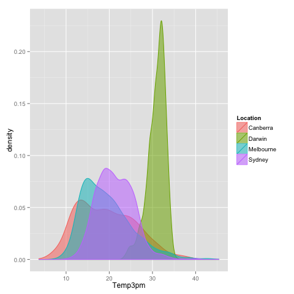
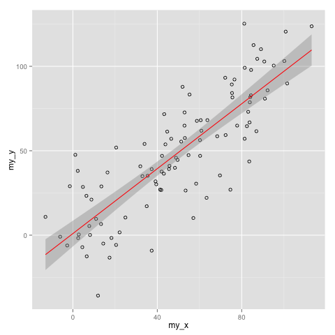
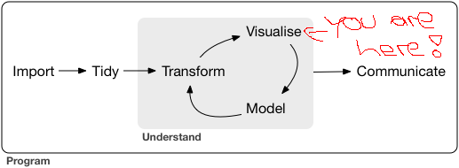

layout: true

```{r setup, include = FALSE}
source("../xaringan_r_setup.R") 
options(warn=-1)
xaringanExtra::use_xaringan_extra(c("tile_view", "clipboard"))
xaringanExtra::use_extra_styles(
  hover_code_line = TRUE,         #<<
  mute_unhighlighted_code = TRUE  #<<
)
```

<div class="my-footer">
  <div style="float: left;"><span>`r gsub("<br />", ", ", gsub("<br /><br />|<a.+$", "", metadata$author))`</span></div>
  <div style="float: right;"><span>`r metadata$location`, `r metadata$date`</span></div>
  <div style="text-align: center;"><span>`r gsub(".+<br />", " ", metadata$subtitle)`</span></div>
</div>

```{css, echo = FALSE}
.tinyish .remark-code { /*Change made here*/
  font-size: 70% !important;
}

.tinyisher .remark-code { /*Change made here*/
  font-size: 50% !important;
}
```

---

## What is `ggplot2`?
`ggplot2` is another `R` package for creating plots and is part of the `tidyverse`.


It uses the *grammar of graphics*. Some things to note about `ggplot2`:
- it is well-suited for multi-dimensional data
- it expects data (frames) as input
- components of the plot are added as layers


```{r plot call, eval = FALSE, echo = TRUE}
plot_call +
  layer_1 +
  layer_2 +
  ... +
  layer_n
```


---
## `ggplot2` examples 
.pull-left[
```{r radar fig, echo = FALSE}
knitr::include_graphics("./pics/143_radar_chart_multi_indiv_2.png")
```
]

.pull-right[
```{r density fig, echo = FALSE}

```
]


<small><small>Sources: https://www.r-graph-gallery.com/wp-content/uploads/2016/05/143_radar_chart_multi_indiv_2.png and https://www.r-graph-gallery.com/wp-content/uploads/2015/09/21_ggplot2_ddensity_plot.png</small></small>

---

## `ggplot2` examples 
.pull-left[
```{r scatter fig, echo = FALSE}

```
]

.pull-right[
```{r map fig, echo = FALSE}
knitr::include_graphics("./pics/328_Hexbin_map_USA_4.png")
```
]

<small><small>Sources: https://www.r-graph-gallery.com/wp-content/uploads/2015/11/51_scatterplot_linear_model_with_CI_ggplot2-300x300.png and https://www.r-graph-gallery.com/wp-content/uploads/2017/12/328_Hexbin_map_USA_4-300x200.png</small></small>

---

## Histograms as in `base R`

```{r echo = FALSE}
gp_covid <- 
  haven::read_sav(
    "../../data/ZA5667_v1-1-0.sav"
  ) %>% 
  sjlabelled::set_na(na = c(-1:-99, 97))
```

.tinyish[
.pull-left[
```{r base_histogram, eval = FALSE}
ggplot(gp_covid, aes(x = age_cat)) + 
  geom_histogram()
```
]
]

.pull-right[
```{r ref.label = "base_histogram", echo = FALSE}
```
]

---

## Components of a plot
According to Wickham (2010, 8)* a layered plot consists of the following components:

<span class="footnote">
<small><small><span class="red bold">*</span> http://dx.doi.org/10.1198/jcgs.2009.07098</small></small>
</span>


- data and aesthetic mappings,
- geometric objects,
- scales,
- and facet specification


```{r plot call example, eval = FALSE, echo = TRUE}
plot_call +
  data +
  aesthetics +
  geometries +
  scales +
  facets
```

---

## Data requirements
You can use one single data frame to create a plot in `ggplot2`.
- everything on the plot is just data
- creates a smooth workflow from data wrangling to the final presentation of the results

```{r data_science_pic, out.width = "70%", echo = FALSE}

```

<small><small>Source: http://r4ds.had.co.nz</small></small>

However, this makes it difficult to add extra features to your plot.
- There are ways of doing it anyway
- Yet, it requires thinking about what to plot

---

## Why the long format? `r ji("horse")`
`ggplot2` prefers data in the long data format (**NB**: of course, only if this is possible and makes sense for the dataset at hand)
- in some scientific disciplines this format is only used for specialized analyses (e.g., time series analysis)

.pull-left[
We may want to get used to it as this format has some benefits:
- every element we aim to plot is an observation
- no thinking required how a specific variable relates to an observation
- most importantly, the long format is more parsimonious
  - it requires less memory and less disk space
]

.pull-right[
```{r long_pic, out.width = "40%", echo = FALSE}
knitr::include_graphics("./pics/long.png")
```
<small><small>Source: https://github.com/gadenbuie/tidyexplain#tidy-data</small></small>
]
  

---

## Before we start: some more examples
The architecture of building plots in `ggplot` is similar to standard `R` graphics. There is an initial plotting call, and subsequently, more stuff is added to the plot. 

However, in `base R`, it is sometimes tricky to find out how to add (or remove) certain plot elements. For example, think of removing the axis ticks in the scatter plot.

We will systematically explore which elements are used in `ggplot` in this session. To get an idea of how easy it is to create figures in `ggplot`, in the following slides, we will look at some of the basic plot types you can choose from.

---

## Scatterplot from previous sessions

```{r load_gp_covid, include = FALSE}
gp_covid <- 
  haven::read_sav(
    "../../data/ZA5667_v1-1-0.sav"
  ) %>% 
  sjlabelled::set_na(na = c(-1:-99, 97))
```

.tinyish[
.pull-left[
```{r scatter, eval = FALSE}
ggplot(
  data = gp_covid,
  aes(
    x = age_cat, 
    y = hzcy001a
  )
) +
  geom_point()
```
]
]

.pull-right[
```{r ref.label = "scatter", echo = FALSE}
```
]

---

## Scatterplot from previous sessions with jitter

.tinyish[
.pull-left[
```{r jitter, eval = FALSE}
ggplot(
  data = gp_covid,
  aes(
    x = age_cat, 
    y = hzcy001a
  )
) +
  geom_jitter()
```
]
]

.pull-right[
```{r ref.label = "jitter", echo = FALSE}
```
]

---

## Boxplots

.tinyish[
.pull-left[
```{r boxplot, eval = FALSE}
ggplot(
  data = gp_covid,
  aes(
    x = as.factor(age_cat), 
    y = hzcy001a
  )
) +
  geom_boxplot()
```
]
]

.pull-right[
```{r ref.label = "boxplot", echo = FALSE}
```
]

---

## Densities

.tinyish[
.pull-left[
```{r density, eval = FALSE}
ggplot(
  data = gp_covid,
  aes(
    x = hzcy001a
  )
) +
  geom_density()
```
]
]

.pull-right[
```{r ref.label = "density", echo = FALSE}
```
]

---

## Creating your own plot
We do not want to give a lecture on the theory behind data visualization (if you want that, we suggest having a look at the excellent book [*Fundamentals of Data Visualization*](https://serialmentor.com/dataviz/) by Claus O. Wilke).
- creating plots is all about practice
- ...and 'borrowing' code from others

.column-left-half[
```{r pseudo, eval = FALSE, echo = TRUE}
please +
  no +
  more +
  pseudo +
  code +
  man
```
]

.column-right-half[
Three components are important:
- Plot initiation
- data input
- aesthetics definition
- so-called geoms
]

---

## Plot initiation
Now, let's start from the beginning and have a closer look at the *grammar of graphics*.

.pull-left[
`ggplot()` is the most basic command to create a plot (similar as `plot()`:

```{r ggplot_basic, eval = FALSE}
ggplot()
```
]

.pull-right[
```{r ref.label = "ggplot_basic", echo = FALSE}
```
]

**But it doesn't show anything...**

---

## Data input

.pull-left[
As we've already learned `ggplot()` expects data as input. We create some interesting plots using data from *Gapminder*.
]

.tinyish[
.pull-right[
```{r load-gapminder-data-display, eval = FALSE}
gapminder_children <- 
  readr::read_csv(
    "./data/children_per_woman_total_fertility.csv"
    ) %>% 
  tidyr::pivot_longer(
    -country, 
    names_to = "year",
    values_to = "children"
  ) %>% 
  dplyr::left_join(
      readr::read_csv(
    "./data/countries_continent.csv"
      )
  ) %>% 
  dplyr::filter(year >= 1950) %>% 
  dplyr::mutate(
    year = as.numeric(year),
    continent = as.factor(continent)
    ) %>% 
  tidyr::drop_na()
```
]
```{r load-gapminder-data, echo = FALSE}
gapminder_children <- 
  readr::read_csv(
    "../../data/children_per_woman_total_fertility.csv"
    ) %>% 
  tidyr::pivot_longer(
    -country, 
    names_to = "year",
    values_to = "children"
  ) %>% 
  dplyr::left_join(
      readr::read_csv(
    "../../data/countries_continent.csv"
      )
  ) %>% 
  dplyr::filter(year >= 1950) %>% 
  dplyr::mutate(
    year = as.numeric(year),
    continent = as.factor(continent)
    ) %>% 
  tidyr::drop_na()
```
]

---

## What now?

.pull-left[
```{r ggplot_data, eval = FALSE}
ggplot(data = gapminder_children)
```
]

.pull-right[
```{r ref.label = "ggplot_data", echo = FALSE}
```
]

**Still nothing there...**

---

## `aes`thetics! 

.pull-left[
`ggplot` requires information about the variables to plot.

```{r ggplot_aes, eval = FALSE}
ggplot(data = gapminder_children) +
  aes(x = year, y = children)
```
]

.pull-right[
```{r ref.label = "ggplot_aes", echo = FALSE}
```
]

**That's a little bit better, right?**

---

## `geom`s!
.pull-left[
Finally, `ggplot` needs information *how* to plot the variables.

```{r ggplot_geom, eval = FALSE}
ggplot(data = gapminder_children) +
  aes(x = year, y = children) +
  geom_point()
```
]

.pull-right[
```{r ref.label = "ggplot_geom", echo = FALSE}
```
]

**A scatter plot!**

---

## Add a fancy `geom`
.pull-left[
We can also add more than one `geom`.

```{r ggplot_line, eval = FALSE}
ggplot(data = gapminder_children) +
  aes(x = year, y = children) +
  geom_point() +
  geom_smooth()
```
]

.pull-right[
```{r ref.label = "ggplot_line", echo = FALSE}
```
]


**A smoothed regression line!** (The regression behind this operation is run automatically)

---

## Going further: adding group `aes`thetics

.pull-left[
We can add different colors for different groups in our data.

```{r ggplot_group, eval = FALSE}
ggplot(
  data = gapminder_children,
  aes(
    x = year, 
    y = children, 
    group = continent
    )
  ) +
  geom_smooth()
```
]

.pull-right[
```{r ref.label = "ggplot_group", echo = FALSE}
```
]

---

## Manipulating group `aes`thetics

.pull-left[
We can also change the colors that are used in the plot.

```{r ggplot_group_man, eval = FALSE}
ggplot(
  data = gapminder_children,
  aes(
    x = year, 
    y = children, 
    color = continent,
    group = continent
    )
  ) +
  geom_smooth() +
  scale_color_brewer(palette = "Paired")
```
]

.pull-right[
```{r ref.label = "ggplot_group_man", echo = FALSE}
```
]

The legend is drawn automatically, that's handy!

---

## Using another palette

.pull-left[
```{r ggplot_group_spectral, eval = FALSE}
ggplot(
  data = gapminder_children,
  aes(
    x = year, 
    y = children, 
    color = continent,
    group = continent
    )
  ) +
  geom_smooth() +
  scale_color_brewer(palette = "Spectral") 
```
]

.pull-right[
```{r ref.label = "ggplot_group_spectral", echo = FALSE}
```
]

---

## Difference between `color` and `fill`
When you work with `ggplot2`, at least after some time, you will be faced with two components of the plot or `geom` associated with colors: `color` and `fill`.

Generally, `color` refers to the geometry borders, such as a line. `fill` refers to a geometry area, such as a polygon.

Have this difference in mind when you use `scale_color_brewer` or `scale_fill_brewer` in your plots. Manipulating these colors and their corresponding legends in an elaborate plot can get really tedious, to be honest. 

---

## Choosing a fill color

.pull-left[
```{r ggplot_group_fill, eval = FALSE}
ggplot(
  data = gapminder_children,
  aes(
    x = year, 
    y = children, 
    color = continent,
    group = continent,
    fill = continent
    )
  ) +
  geom_smooth() +
  scale_color_brewer(palette = "Spectral") +
  scale_fill_brewer(palette = "Dark2")
```
]

.pull-right[
```{r ref.label = "ggplot_group_fill", echo = FALSE}
```
]

---

## Colors and `theme`s
One particular strength of `ggplot2` lies in its immense theming capabilities. The package has some built-in theme functions that makes theming a plot fairly easy, e.g.,
- `theme_bw()`
- `theme_dark()`
- `theme_void()`
- etc.

See: https://ggplot2.tidyverse.org/reference/ggtheme.html


If you want to, you can play around with some of those themes in the exercises for this session.

In general, the [`r-color-palettes` repository by Emil Hvitfeldt](https://github.com/EmilHvitfeldt/r-color-palettes) is a good resource for choosing color palettes in `R` and there are many collections of full `ggplot2` themes out there (e.g., the [`hrbrthemes` package](https://github.com/hrbrmstr/hrbrthemes)).

---

## Alternative to being too colorful: facets
.pull-left[
```{r facet_wrap, eval = FALSE}
ggplot(
  data = gapminder_children,
  aes(
    x = year, 
    y = children
    )
  ) +
  geom_smooth(color = "black") +
  facet_wrap(~continent, ncol = 3) +
  theme_bw()
```
]

.pull-right[
```{r ref.label = "facet_wrap", echo = FALSE}
```
]

---

## The `theme()` argument in general
The most direct interface for manipulating your theme is the `theme()` argument. Here you can change the appearance of:
- axis labels
- captions and titles
- legend
- grid layout
- the wrapping strips
- ...

---

## Example: changing the grid layout & axis labels
.pull-left[
```{r grid_layout, eval = FALSE}
ggplot(
  data = gapminder_children,
  aes(
    x = year, 
    y = children
    )
  ) +
  geom_smooth(color = "black") +
  facet_wrap(~continent, ncol = 3) +
  theme_bw() +
  theme(
    panel.grid.major = element_blank(), 
    panel.grid.minor = element_blank(),
    strip.background = element_rect(fill = "white")
  )
```
]

.pull-right[
```{r ref.label = "grid_layout", echo = FALSE}
```
]

---

## Example: changing  axis labels
.pull-left[
```{r axis_labels, eval = FALSE}
ggplot(
  data = gapminder_children,
  aes(
    x = year, 
    y = children
    )
  ) +
  geom_smooth(color = "black") +
  facet_wrap(~continent, ncol = 3) +
  theme_bw() +
  theme(
    panel.grid.major = element_blank(), 
    panel.grid.minor = element_blank(),
    strip.background = element_rect(fill = "white")
  ) + 
  ylab("Number of Children") +
  xlab("Year")
```
]

.pull-right[
```{r ref.label = "axis_labels", echo = FALSE}
```
]

---

## Another remark on plotting options

.pull-left[
Working with combined aesthetics and different data inputs can become cumbersome.

Particularly, plotting similar aesthetics which interfere with the automatic procedures can create conflicts.

Some 'favourites' include:
- Multiple legends
- and various color scales for similar `geoms` 
- ... and there's more!
]

.pull-right[
```{r der_schrei, echo = FALSE}
knitr::include_graphics("./pics/800px-The_Scream.jpg")
```
]

.right[
<small><small>Source: https://de.wikipedia.org/wiki/Der_Schrei#/media/File:The_Scream.jpg</small></small>
]

---

## `ggplot` plots are 'simple' objects
In contrast to standard `R` plots, `ggplot2` are standard objects like any other object in `R` (they are lists). So there is no graphics device involved from which we have recorded our plot to re-use it later. We can just use it directly.

```{r eval = FALSE}
my_fancy_plot <- 
  ggplot(data = gapminder_children) +
  aes(x = year, y = children) +
  geom_point() 

my_fancy_plot <- 
  my_fancy_plot +
  geom_smooth()
```

Additionally, there is also no need to call `dev.off()`

---

## It makes combining plots easy
As of today, there are now a lot of packages that help to combine `ggplot2`s fairly easily. For example, the [`cowplot` package](https://cran.r-project.org/web/packages/cowplot/index.html) provides a really flexible framework. I have used `cowplot` to create the map in the previous session.

Yet, fiddling with this package can become quite complicated. One of my favorite packages at the moment is the [`patchwork` package](https://cran.r-project.org/web/packages/patchwork/index.html) because of its easy to use syntax. It's really, really easy.

---

## Plotting side by side in one row
.pull-left[
```{r one_row, eval = FALSE}
library(patchwork)

my_histogram <- 
  ggplot(
    gp_covid, 
    aes(x = age_cat)
  ) + 
  geom_histogram()

my_boxplot <-  
  ggplot(
    gp_covid, 
    aes(y = age_cat)
  ) + 
  geom_boxplot()

my_histogram | my_boxplot
```
]

.pull-right[
```{r ref.label = "one_row", echo = FALSE}
```
]

---

## Plotting in two columns
.pull-left[
```{r one_column, eval = FALSE}
my_histogram / my_boxplot
```
]

.pull-right[
```{r ref.label = "one_column", echo = FALSE}
```
]

---

## combine them with base R graphics
.pull-left[
```{r combine_base, eval = FALSE}
(my_histogram | ~hist(gp_covid$age_cat)) /
  (my_boxplot | ~boxplot(gp_covid$age_cat))
```
]

.pull-right[
```{r ref.label = "combine_base", echo = FALSE}
```
]

---

## There's more
You can also annotate plots with titles, subtitles, captions, and tags.

You can nest plots and introduce more complex layouts.

I'd recommend, if you're interested, to check out the [`patchwork` repository on *GitHub*](https://github.com/thomasp85/patchwork) since everything is really well-documented there.

---

## Shortcuts in `ggplot`

`ggplot2` is powerful...
- yet, it is admittedly somewhat complicated to use in the beginning
- and it has a steep learning curve

However, there are some convenient shortcuts that you can use for creating simple plots.

---

## `qplot()` or `quickplot()`

.pull-left[
```{r qplot_example, eval = FALSE}
qplot(
  x = gapminder_children$year, 
  y = gapminder_children$children,
  geom = "point",
  group = gapminder_children$continent
  )
```
]

--

.pull-right[
```{r ref.label = "qplot_example", echo = FALSE}
```
]

---

## `qplot()` or `quickplot()`

.pull-left[
```{r qplot_example_2, eval = FALSE}
qplot(
  x = gapminder_children$year, 
  y = gapminder_children$children,
  geom = c("point", "smooth")
  )
```
]

.pull-right[
```{r ref.label = "qplot_example_2", echo = FALSE}
```
]

---

## Exporting ggplot graphics
Exporting `ggplot2` graphics is fairly easy with the `ggsave()` function. It automatically detects the file format. You can also define the plot height, width, and dpi, which is particularly useful to produce high-class graphics for publications.

```{r eval = FALSE}
nice_plot <- 
  qplot(
    x = gapminder_children$year, 
    y = gapminder_children$children,
    geom = c("point", "smooth")
  )

ggsave("nice_plot.png", nice_plot, dpi = 300)
```

Or:

```{r eval = FALSE}
ggsave("nice_plot.tiff", nice_plot, dpi = 300)
```

---

## Some additional resources

- [ggplot2 - Elegant Graphics for Data Analysis](https://www.springer.com/gp/book/9783319242750) by Hadley Wickham

- [Chapter 3](https://r4ds.had.co.nz/data-visualisation.html) in *R for Data Science*

- [Fundamentals of Data Visualization](https://serialmentor.com/dataviz/) by Claus O. Wilke

- [Data Visualization - A Practical Introduction](https://press.princeton.edu/titles/13826.html) by Kieran Healy

- [data-to-viz](https://www.data-to-viz.com/)

- [R Graph Gallery](https://www.r-graph-gallery.com/)

- [BBC Visual and Data Journalism cookbook for R graphics](https://bbc.github.io/rcookbook/#how_to_create_bbc_style_graphics)

- [ggplot2 extensions](http://www.ggplot2-exts.org/gallery/)

---

class: center, middle

# [Exercise](https://jobreu.github.io/r-intro-gesis-2020/exercises/Day3_2_Data_Visualization_2_Exercise_question.html) time `r ji("weight_lifting_woman")``r ji("muscle")``r ji("running_man")``r ji("biking_man")`

## [Solutions](https://jobreu.github.io/r-intro-gesis-2020/solutions/Day3_2_Data_Visualization_2_Exercise_solution.html)

---

## Extracurricular activities

Plotting erroneous data in standard `R` often produces error messages. In `ggplot2`, instead, you may produce funny graphics that you did not intend to create in the first place. It's a whole genre nowadays, and [this Twitter account](https://twitter.com/accidental__art?lang=en) collects a lot of these sometimes funny plots. You should definitely have a look!